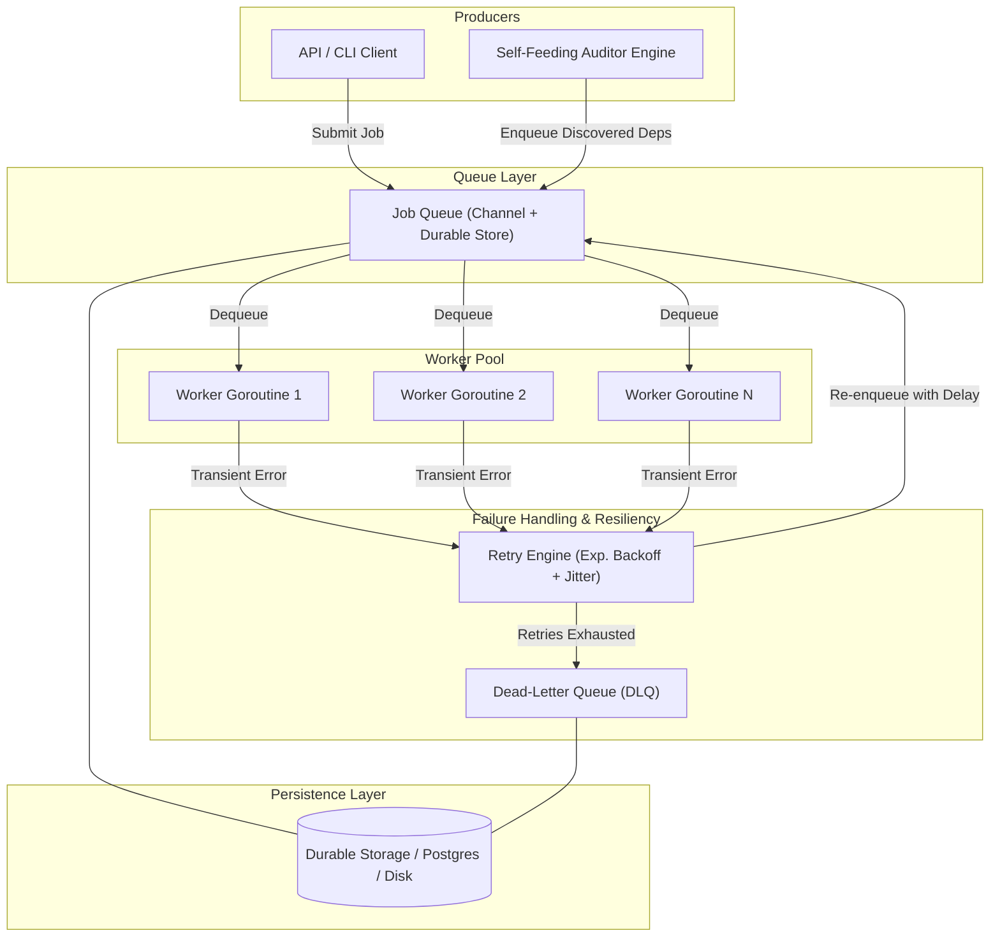
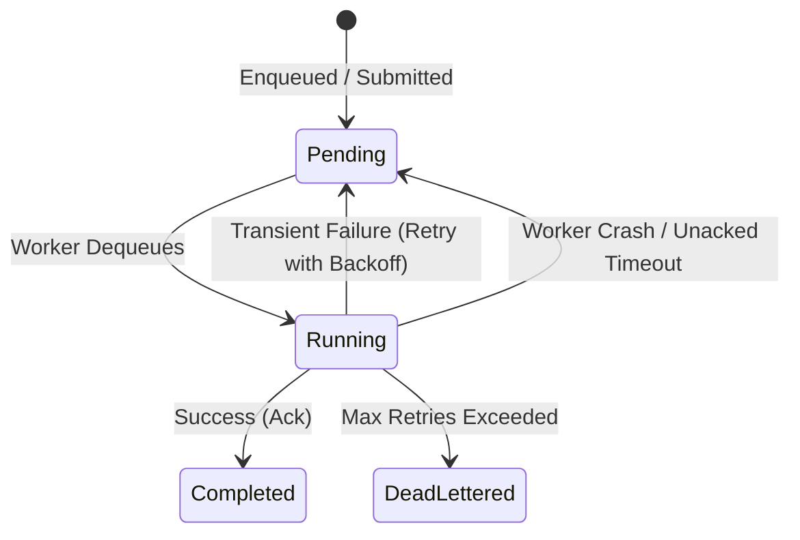
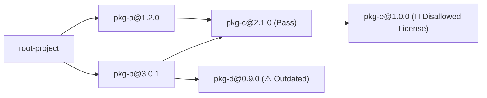

# Mini Distributed Job API & Dependency Auditor

A robust, crash-resilient job queue engine in Go paired with a self-feeding dependency and license graph auditor as its reference workload.

---

## Overview

The **Mini Distributed Job API** is a modular, high-throughput background job processing system designed to handle asynchronous tasks reliably. Rather than only serving simple fire-and-forget tasks, it provides a full suite of distributed systems primitives: bounded concurrency pools, at-least-once delivery, retry mechanics with exponential backoff and jitter, dead-letter queues, crash-resilient persistence, and graceful drain-on-shutdown.

To put these mechanics through rigorous, adversarial conditions, the system includes a **Self-Feeding Dependency and License Auditor** reference workload. The auditor parses package manifests, recursively resolves transitive dependencies across external registries, evaluates packages against compliance and security policies, and produces an annotated directed dependency graph.

---

## Core System Architecture



---

## Key Architectural Highlights

### 1. Bounded Worker Pool & Backpressure
- Concurrency is capped by a fixed number of worker goroutines rather than unbounded per-job goroutine creation.
- The queue acts as a shock absorber during self-feeding bursts, protecting downstream services and package registries from thundering herds.

### 2. At-Least-Once Delivery & Idempotency
- Workers explicitly acknowledge (*ack*) completed jobs.
- If a worker crashes mid-execution, the unacknowledged job remains available or is reclaimed on restart.
- All handlers are designed to be idempotent or deduplicated via unique entity keys.

### 3. Fault Tolerance & Retry Engine
- Transient failures (e.g., registry rate limits, 5xx server errors, network timeouts) are retried with exponential backoff and full randomization jitter ($t = 2^{\text{attempt}} + \text{rand}$).
- Eliminates synchronous retry spikes and prevents cascading failures across dependencies.

### 4. Dead-Letter Queue (DLQ)
- Jobs exceeding maximum retry thresholds are quarantined into a durable Dead-Letter Queue with error context preserved for inspection.

### 5. Graceful Shutdown & Drain
- On termination signals (`SIGINT`, `SIGTERM`), the engine stops accepting new submissions, allows running workers to finish within a configurable timeout, and cleanly flushes state.

---

## Job State Lifecycle



---

## Reference Workload: Self-Feeding Dependency Auditor

The auditor traverses and audits a project's full transitive dependency graph:



### Why this workload?
- **Deduplication:** Traverses cyclic and diamond dependency graphs without infinite loops using a shared seen/visited registry.
- **Dynamic Work Expansion:** Resolving a package dynamically discovers child dependencies and enqueues new sub-jobs back into the queue.
- **Policy Enforcement:** Flags disallowed open-source licenses (e.g., AGPL/GPL when prohibited), outdated semantic versions, and security vulnerabilities.

---

## Repository Structure

```
.
├── cmd/
│   └── auditor/           # Auditor CLI entrypoint
├── docs/                  # Detailed architectural & component specifications
│   ├── architecture.md
│   ├── data-models.md
│   ├── dead-letter-queue.md
│   ├── dependency-auditor.md
│   ├── future-enhancements.md
│   ├── graceful-shutdown.md
│   ├── job-queue.md
│   ├── project-context.md
│   ├── retry-engine.md
│   ├── worker-pool.md
│   └── implementation/    # Step-by-step implementation guides
├── internal/
│   ├── auditor/           # Dependency resolution, policy checks, & reporting
│   ├── depfile/           # Dependency manifest parsing (package.json, go.mod)
│   ├── job/               # Job definitions, interfaces, and state types
│   ├── queue/             # In-memory and persistent queue implementations
│   ├── semver/            # Semantic version constraint matching
│   └── worker/            # Bounded worker pool implementation
├── go.mod
└── go.sum
```

---

## Build Phases

| Phase | Milestone | Focus Area |
|:---:|:---|:---|
| **Phase 1** | Bounded Worker Pool & Auditor Happy Path | Queue buffering, worker pool concurrency, and self-feeding job expansion |
| **Phase 2** | Retry Engine | Exponential backoff, full jitter, and transient failure recovery |
| **Phase 3** | Dead-Letter Queue (DLQ) | Poison pill isolation, quarantine thresholds, and error metadata |
| **Phase 4** | Durability & Resumability | Postgres/Disk persistence layer, crash recovery, and restart frontiers |
| **Phase 5** | Graceful Shutdown | Clean signal interception, in-flight job drain, and bounded timeouts |

---

## Getting Started

### Prerequisites
- [Go 1.22+](https://go.dev/dl/)

### Running Tests
To run all unit and integration test suites:
```bash
go test -v ./...
```

### Building the Auditor
```bash
go build -o bin/auditor ./cmd/auditor
```

---

## Documentation

For comprehensive technical deep dives, consult the specifications in `docs/`:
- [Architecture Overview](docs/architecture.md)
- [Worker Pool Specification](docs/worker-pool.md)
- [Job Queue Details](docs/job-queue.md)
- [Retry Engine & Backoff](docs/retry-engine.md)
- [Dead-Letter Queue](docs/dead-letter-queue.md)
- [Graceful Shutdown Protocol](docs/graceful-shutdown.md)
- [Data Models](docs/data-models.md)
- [Dependency Auditor Reference Workload](docs/dependency-auditor.md)
