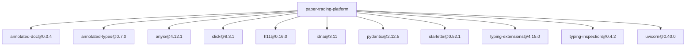
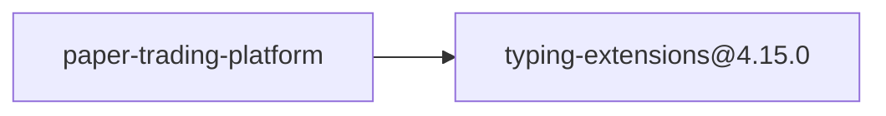
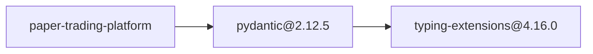
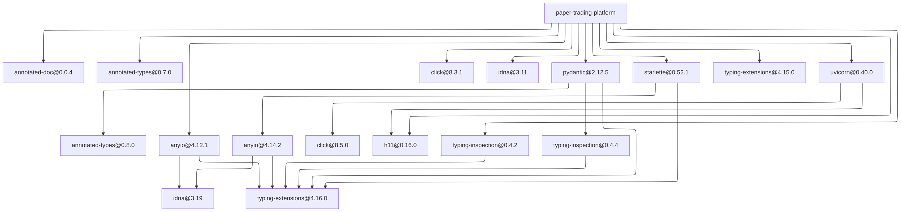

# Dependency Audit Report

## Summary

- Root: `paper-trading-platform`
- Python platform: `linux`
- Python version: `3.12`
- Packages scanned: 17
- Policy violations: 2

## Dependency Overview

## Violation Paths

### `typing-extensions@4.15.0`

### `typing-extensions@4.16.0`

## Complete Dependency Graph

Show all 17 packages and 24 edges

## Packages

| Package | Version | License | Verdict |
|---|---|---|---|
| `annotated-doc` | `0.0.4` | `MIT` | `pass` |
| `annotated-types` | `0.7.0` | `MIT` | `pass` |
| `annotated-types` | `0.8.0` | `MIT` | `pass` |
| `anyio` | `4.12.1` | `MIT` | `pass` |
| `anyio` | `4.14.2` | `MIT` | `pass` |
| `click` | `8.3.1` | `BSD-3-Clause` | `pass` |
| `click` | `8.5.0` | `BSD-3-Clause` | `pass` |
| `h11` | `0.16.0` | `MIT` | `pass` |
| `idna` | `3.11` | `BSD-3-Clause` | `pass` |
| `idna` | `3.19` | `BSD-3-Clause` | `pass` |
| `pydantic` | `2.12.5` | `MIT` | `pass` |
| `starlette` | `0.52.1` | `BSD-3-Clause` | `pass` |
| `typing-extensions` | `4.15.0` | `PSF-2.0` | `policy_violation` |
| `typing-extensions` | `4.16.0` | `PSF-2.0` | `policy_violation` |
| `typing-inspection` | `0.4.2` | `MIT` | `pass` |
| `typing-inspection` | `0.4.4` | `MIT` | `pass` |
| `uvicorn` | `0.40.0` | `BSD-3-Clause` | `pass` |

## Policy Violations

| Package | License | Dependency path |
|---|---|---|
| `typing-extensions@4.15.0` | `PSF-2.0` | `paper-trading-platform → typing-extensions@4.15.0` |
| `typing-extensions@4.16.0` | `PSF-2.0` | `paper-trading-platform → pydantic@2.12.5 → typing-extensions@4.16.0` |
