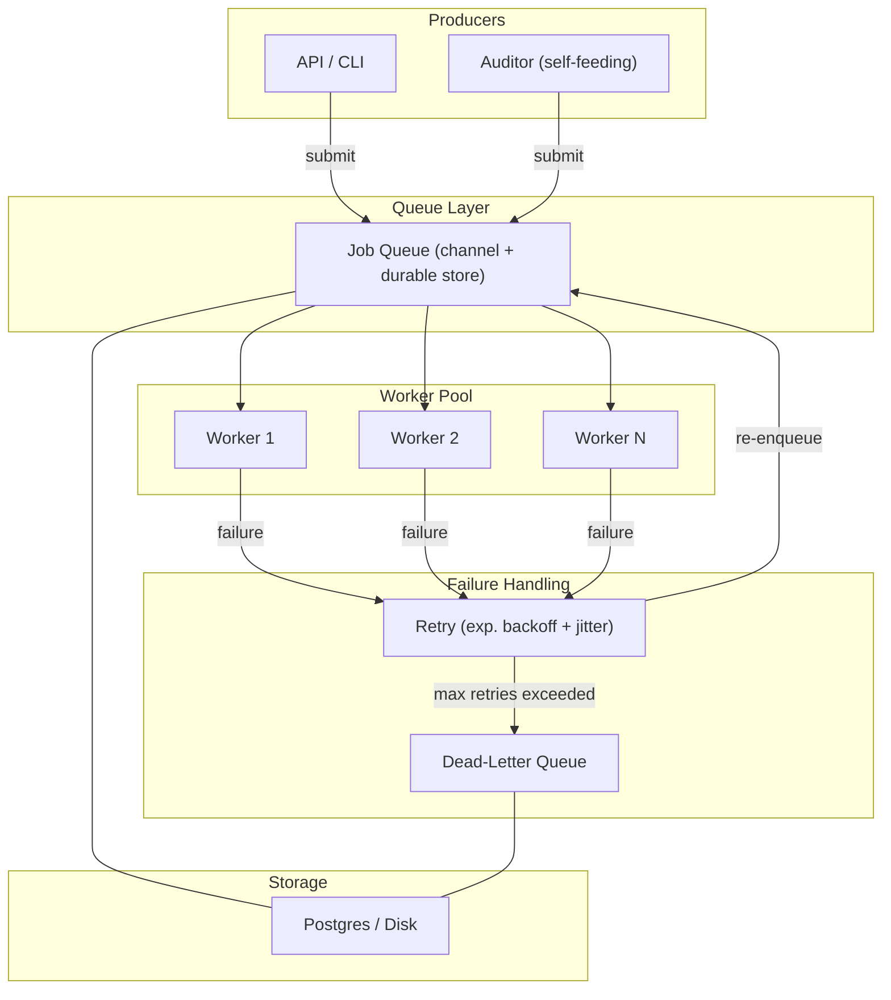
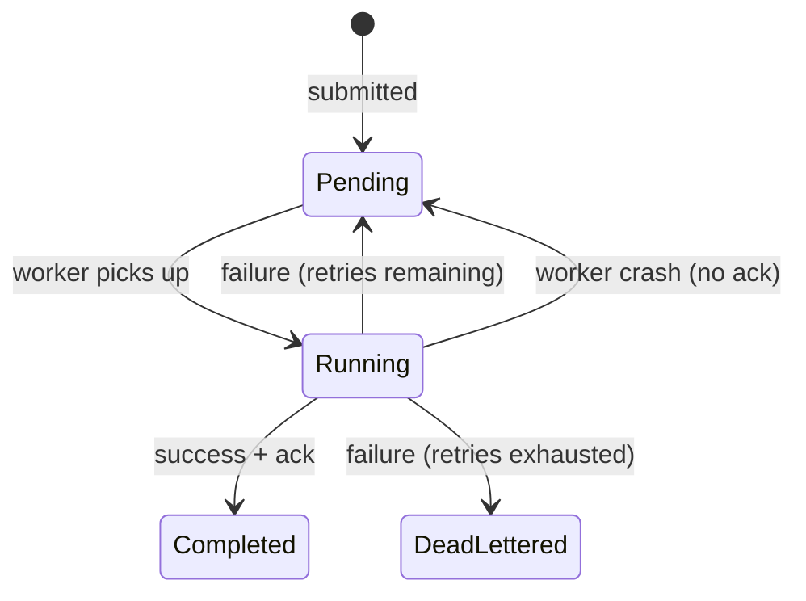
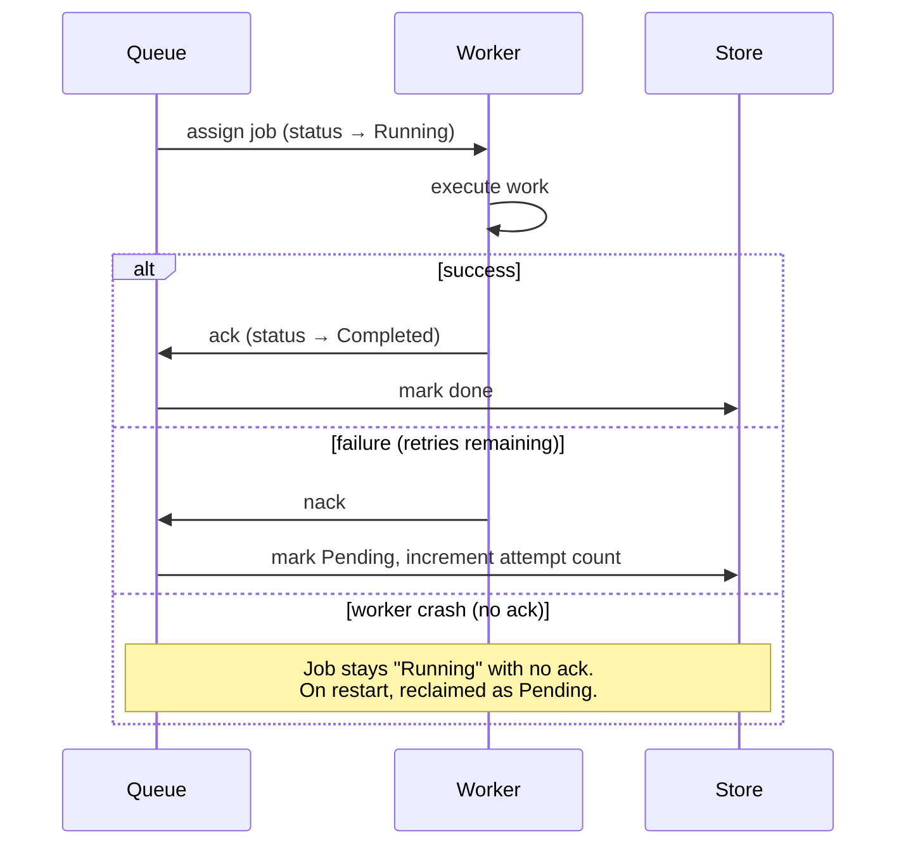
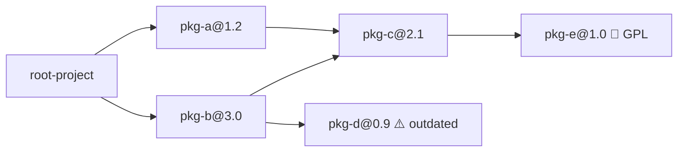

# Architecture — Durable Job Queue with Dependency Auditor

## System Overview

The system is a **durable job queue** implemented in Go, paired with a **self-feeding dependency and license auditor** as its reference workload. The queue is the core deliverable — a reusable subsystem for reliable background work execution. The auditor proves the queue works under realistic, adversarial conditions.

---

## Core Components

### 1. Job Queue

The queue decouples producers from workers. Producers submit job descriptions and return immediately; workers pull jobs at their own pace.

| Property | Detail |
|---|---|
| **Interface** | Go channel fronting a durable store |
| **Backpressure** | Queue absorbs bursts — workers drain at a fixed rate |
| **Durability** | Backed by Postgres or disk so jobs survive crashes |

A job entering the queue transitions through a well-defined set of states:

### 2. Bounded Worker Pool

A **fixed** number of worker goroutines loop: take a job → run it → repeat.

- **Why bounded?** Spawning a goroutine per job means unbounded concurrency — memory exhaustion and downstream hammering. A fixed pool caps in-flight work regardless of queue depth.
- **Tradeoff:** Pool size is a genuine tuning knob. Too few → slow drain. Too many → overwhelm the downstream (e.g., a rate-limited registry).

### 3. Retry Engine (Exponential Backoff + Jitter)

Transient failures (network blips, 5xx, rate-limit rejections) are retried — but naively:

| Mechanism | Purpose |
|---|---|
| **Exponential backoff** | 1s → 2s → 4s → 8s … prevents hammering a struggling downstream |
| **Jitter** | Random offset prevents a thundering herd when many jobs fail at the same instant |
| **Retry cap** | Finite retries prevent infinite loops; exceeded → dead-letter |

### 4. Dead-Letter Queue (DLQ)

After a capped number of failures, a job moves to the DLQ instead of retrying forever. This keeps the live queue clear while preserving failed work for later investigation. The DLQ is also durably stored.

### 5. Graceful Shutdown

On stop signal:

1. **Stop accepting** new jobs.
2. **Drain** — let in-flight workers finish their current job.
3. **Timeout** — if a worker is stuck past a deadline, force-exit so a single hung job cannot block shutdown forever.

This makes restarts safe — no work is silently dropped.

### 6. Durable Storage

Backing the queue and DLQ with **Postgres or disk** upgrades the system from in-memory toy to crash-safe infrastructure. Long-running work becomes resumable rather than restart-from-zero.

---

## Delivery Semantics

> **At-least-once delivery** — every job runs one or more times, never zero.

This is the central design decision. The ack protocol works as follows:

**Consequence:** Jobs must be **idempotent** or **deduplicated**. Running a job twice must produce the same result or be a no-op (e.g., via a unique key check).

---

## Reference Workload — Dependency & License Auditor

The auditor traverses a project's full transitive dependency graph. It is **self-feeding**: resolving one package discovers its dependencies, each of which becomes a new job.

### How It Starts

The auditor reads the root project's dependency file (e.g., `package.json`, `go.mod`) and enqueues one job per direct dependency. Version ranges are resolved to exact versions at this stage.

### Single Job — 5 Steps

> **Resolve and audit package _P_ at version _V_.**

A worker runs these steps in order:

1. **Fetch metadata** — HTTP GET to the package registry. This is the I/O-bound step.
2. **Audit against policy** — check license, version freshness, and known vulnerabilities. Produce a verdict: `Pass`, `PolicyViolation`, or `Unresolvable`.
3. **Save the node** — write a `Package` row to Postgres (`ON CONFLICT DO NOTHING` for idempotency).
4. **Save the edges** — write a `DependencyEdge` row for each direct dependency discovered.
5. **Enqueue new jobs** — for each dependency not already in the `packages` table, create a new job. This is the self-feeding step.

### Deduplication

The `packages` table doubles as the "seen" set. Before enqueuing a dependency, the worker checks if `(name, version)` already exists. If it does, the package has been audited or is in progress — skip it. This is what stops diamonds from duplicating work and cycles from running forever.

At the database level, `ON CONFLICT DO NOTHING` handles race conditions — if two workers try to insert the same package simultaneously, one succeeds and the other is a no-op.

### Why This Workload

The auditor is chosen because it makes every queue mechanism **load-bearing**, not decorative:

| Queue Mechanism | What the Auditor Stresses |
|---|---|
| **Deduplication** | Dependency diamonds and cycles — without a shared "seen" set, the same package is enqueued repeatedly and cycles never terminate |
| **Bounded concurrency** | Resolution is I/O-bound against a rate-limited registry; the pool caps in-flight requests regardless of graph size |
| **Retries + backoff** | Registry timeouts, 5xx responses, and rate-limit rejections are absorbed without dropping entire subtrees |
| **Dead-letter queue** | Packages removed from the registry or malformed land in the DLQ; the audit completes with a clear record of what couldn't be resolved |
| **Durability** | A large audit is resumable — an interrupted run continues from its frontier, not from scratch |

### Output

The deliverable is an **annotated directed graph** plus a **report**:

- **Nodes:** audited packages, each annotated with a verdict (pass / policy violation / unresolvable).
- **Edges:** "depends on" relationships discovered during resolution.
- **Report contents:**

| Section | Source |
|---|---|
| Policy violations | `packages` where verdict = `PolicyViolation` |
| Dependency paths | Walk `edges` backwards from each violation to the root |
| Unresolvable packages | `jobs` where status = `DeadLettered` |

---

## Build Order

Each layer is built and tested before the next, ensuring a working system at every stage:

| Phase | Layer | What's Proven |
|---|---|---|
| 1 | Bounded worker pool + happy path | Producers → queue → workers → job execution |
| 2 | Retries with exponential backoff + jitter | Transient failures are absorbed, not lost |
| 3 | Dead-letter queue | Permanently failing jobs are quarantined |
| 4 | Durable storage (Postgres / disk) | Jobs survive crashes; long audits are resumable |
| 5 | Graceful shutdown with drain + timeout | Restarts are safe; no in-flight work is dropped |

The auditor workload can be introduced from Phase 1 onward — even a basic pool running resolve-and-expand jobs demonstrates self-feeding expansion and backpressure.

---

## Defensibility

Three questions must be airtight:

1. **What happens if a worker crashes mid-job?**
   → At-least-once delivery + idempotency / deduplication.

2. **What stops a retry storm from taking down a struggling downstream?**
   → Exponential backoff, jitter, and the dead-letter queue cap.

3. **How does the pool size create backpressure?**
   → Bounded concurrency — the queue absorbs bursts, workers drain at a fixed rate.
