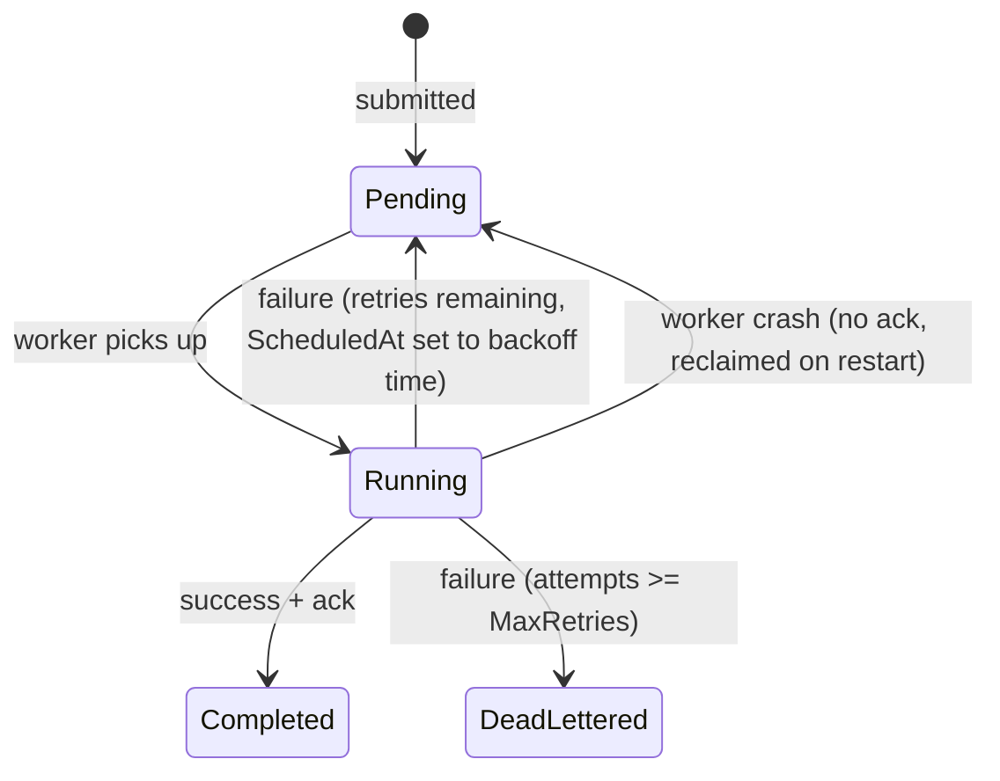
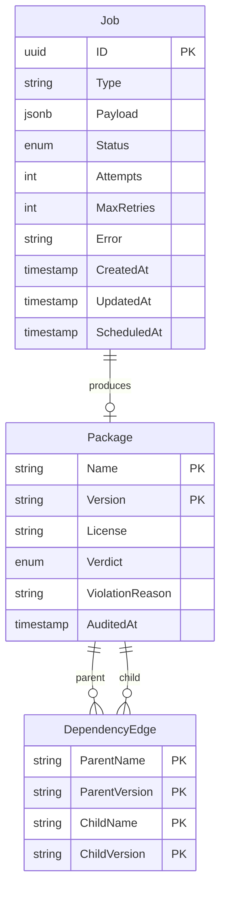

# Data Models

Two domains: the **job queue** (generic, reusable) and the **dependency auditor** (reference workload). Only the models directly required by the project context are included.

---

## Job Queue

### Job

The central entity. Represents a unit of work submitted to the queue.

| Field | Type | Description |
|---|---|---|
| `ID` | `uuid` | Unique job identifier |
| `Type` | `string` | Job kind (e.g., `"audit_package"`) |
| `Payload` | `jsonb` | Arbitrary input data for the job handler |
| `Status` | `enum` | Current state (see state machine below) |
| `Attempts` | `int` | Number of times this job has been tried |
| `MaxRetries` | `int` | Retry cap — exceeded moves job to DLQ |
| `Error` | `string` | Most recent failure reason |
| `CreatedAt` | `timestamp` | When the job was submitted |
| `UpdatedAt` | `timestamp` | Last state transition |
| `ScheduledAt` | `timestamp` | Earliest time the job can run next (supports backoff delays) |

**Status values:**

```
Pending → Running → Completed
                  → Failed (transient, will retry)
                  → DeadLettered (retries exhausted)
```

**State transitions:**



---

## Dependency Auditor

### Package

A node in the dependency graph. Created when a worker successfully resolves and audits a package.

| Field | Type | Description |
|---|---|---|
| `Name` | `string` | Package name (e.g., `"express"`) |
| `Version` | `string` | Resolved version (e.g., `"4.18.2"`) |
| `License` | `string` | Detected license (e.g., `"MIT"`, `"GPL-3.0"`) |
| `Verdict` | `enum` | Audit result: `Pass`, `PolicyViolation`, `Unresolvable` |
| `ViolationReason` | `string` | Why it failed policy (empty if `Pass`) |
| `AuditedAt` | `timestamp` | When the audit completed |

**Primary key:** `(Name, Version)` — a package is uniquely identified by its name and version together.

### DependencyEdge

An edge in the dependency graph. Records that one package depends on another.

| Field | Type | Description |
|---|---|---|
| `ParentName` | `string` | The package that has the dependency |
| `ParentVersion` | `string` | Its version |
| `ChildName` | `string` | The dependency it requires |
| `ChildVersion` | `string` | The required version |

**Primary key:** `(ParentName, ParentVersion, ChildName, ChildVersion)`

### Deduplication

Deduplication is handled by checking the `Package` table before enqueuing. If `(Name, Version)` already exists, the package has been seen and no new job is created. This is what prevents diamonds from producing duplicate work and cycles from running forever.

---

## How They Connect



A Job's `Payload` contains `{"name": "express", "version": "4.18.2"}`. When a worker processes it, it:

1. Creates a `Package` row with the audit verdict.
2. Creates `DependencyEdge` rows for each discovered dependency.
3. Checks `Package` for each dependency — if not seen, enqueues a new `Job`.
