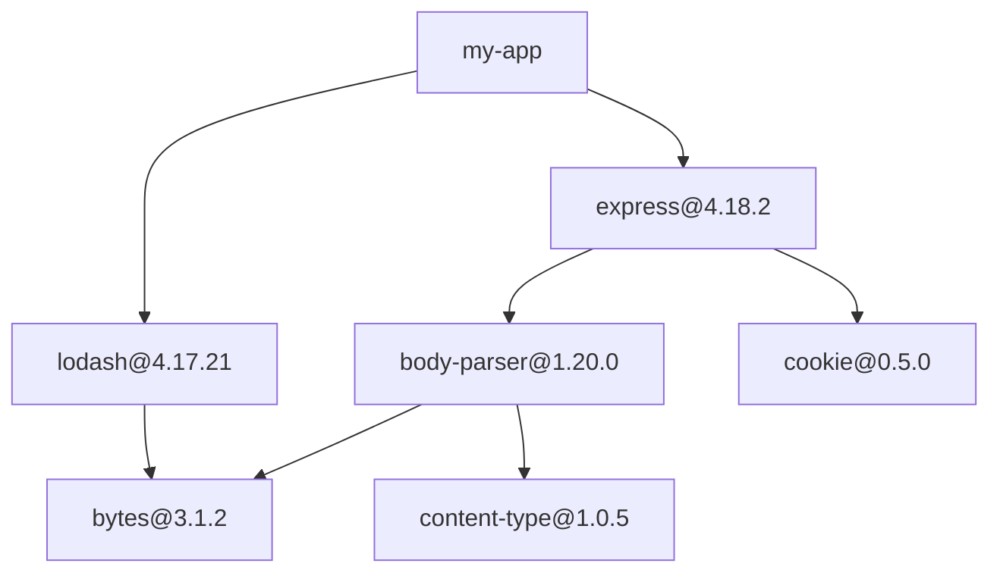

# Dependency & License Auditor

The auditor is the reference workload that exercises the job queue. Given a root project, it traverses the full transitive dependency graph, audits each package against policy, and produces an annotated graph plus a report.

---

## How It Starts

The auditor reads the root project's dependency file (e.g., `package.json`, `go.mod`, `requirements.txt`) and creates one job per direct dependency:

```
Input: package.json
{
  "dependencies": {
    "express": "^4.18.0",
    "lodash": "^4.17.0"
  }
}

Result: 2 jobs enqueued
  → { type: "audit_package", payload: { name: "express", version: "4.18.2" } }
  → { type: "audit_package", payload: { name: "lodash", version: "4.17.21" } }
```

Version ranges (e.g., `^4.18.0`) are resolved to exact versions (e.g., `4.18.2`) at this stage.

---

## What a Single Job Does

Each job audits **one package at one version**. A worker runs these steps in order:

### Step 1 — Fetch metadata from the registry

```
HTTP GET → registry API (e.g., https://registry.npmjs.org/express/4.18.2)

Response includes:
  - License
  - Direct dependencies (name + version range)
  - Other metadata
```

This is the I/O-bound step — the worker spends most of its time waiting for the network.

### Step 2 — Audit against policy

Check the package against a set of rules:

| Check | Example violation |
|---|---|
| **License** | GPL-3.0 in a project that only allows MIT/Apache-2.0 |
| **Version freshness** | Package is 3+ major versions behind latest |
| **Known vulnerabilities** | Version matches a known CVE |

The result is a verdict: `Pass`, `PolicyViolation`, or `Unresolvable`.

### Step 3 — Save the node

Write a `Package` row to Postgres:

```
INSERT INTO packages (name, version, license, verdict, violation_reason, audited_at)
VALUES ('express', '4.18.2', 'MIT', 'pass', NULL, NOW())
ON CONFLICT (name, version) DO NOTHING
```

`ON CONFLICT DO NOTHING` — if this package was already audited (race condition with another worker), skip it. This is idempotency at the database level.

### Step 4 — Save the edges

For each of the package's direct dependencies, write a `DependencyEdge` row:

```
INSERT INTO edges (parent_name, parent_version, child_name, child_version)
VALUES ('express', '4.18.2', 'body-parser', '1.20.0')
```

### Step 5 — Enqueue new jobs (the self-feeding part)

For each dependency discovered in step 1:

```
Check: does (name, version) exist in the packages table?
  → Yes: already seen, skip
  → No:  enqueue a new job for this package
```

This is where deduplication happens. The `packages` table doubles as the "seen" set.

---

## The Traversal

The auditor is a **breadth-first graph traversal** powered by the job queue:



### Round by round

| Round | Jobs processed | New deps found | Already seen | New jobs enqueued | Total nodes |
|---|---|---|---|---|---|
| 1 | express, lodash | 5 | 0 | 5 | 2 |
| 2 | body-parser, cookie, + 3 others | 8 | 2 | 6 | 7 |
| 3 | bytes, content-type, + 4 others | 3 | 3 | 0 | 13 |
| Done | Queue empty | — | — | — | 13 |

The traversal ends when every discovered dependency has already been seen. At that point, no new jobs are enqueued, the queue drains to empty, and the audit is complete.

### Diamonds

Two packages depend on the same library:

```
express → bytes@3.1.2
lodash  → bytes@3.1.2
```

Whichever worker reaches `bytes` first creates the `Package` row. The second worker's `ON CONFLICT DO NOTHING` skips it. Only one job is enqueued for `bytes`, not two.

### Cycles

```
pkg-x → pkg-y → pkg-z → pkg-x
```

When `pkg-z` tries to enqueue `pkg-x`, it's already in the `packages` table. The check says "already seen" and skips it. The cycle is broken.

---

## The Output

When the queue is empty, the audit is complete. The database contains the full graph. Two deliverables are produced:

### 1. The annotated graph

Every node (package) has a verdict. Every edge (dependency relationship) is recorded. The graph can be queried or visualized directly from Postgres.

### 2. The report

| Section | Content | Source |
|---|---|---|
| **Policy violations** | Packages with disallowed licenses, outdated versions, or known vulnerabilities | `SELECT * FROM packages WHERE verdict = 'PolicyViolation'` |
| **Dependency paths** | How each violating package was pulled in (the chain from root to violation) | Walk edges backwards from the violating package to the root |
| **Unresolvable packages** | Packages that could not be fetched from the registry after all retries | `SELECT * FROM jobs WHERE status = 'DeadLettered'` |

#### Dependency path example

```
Why is evil-lib@0.1.0 (GPL-3.0) in your project?

my-app
  → express@4.18.2
    → body-parser@1.20.0
      → evil-lib@0.1.0  ⚠ GPL-3.0 (disallowed)
```

This path is constructed by walking the `edges` table from `evil-lib` back to the root.

---

## Design Decisions

### 1. One job per package, not one job per project

**Decision:** Each job audits a single package at a single version. The full graph is built from many small jobs.

**Tradeoff:** More jobs (hundreds or thousands), but each is small, independent, and retryable. If one package fails, only that package retries — the rest of the graph is unaffected. A single monolithic "audit everything" job would be simpler but would mean any failure restarts the entire audit.

### 2. Packages table as the seen set

**Decision:** Deduplication checks the `packages` table directly rather than maintaining a separate in-memory set.

**Tradeoff:** Slightly slower (database query vs. in-memory lookup), but survives crashes. An in-memory set is lost on restart, meaning the audit would re-enqueue packages it already processed. The database check is durable and consistent across all workers without synchronization.

### 3. Idempotency via ON CONFLICT DO NOTHING

**Decision:** If a package is audited twice (due to at-least-once delivery), the second write is a no-op at the database level.

**Tradeoff:** Simple and correct. The alternative — checking before writing — has a race condition (two workers check simultaneously, both see "not present," both write). `ON CONFLICT` handles this atomically at the database level with no application-level locking.
