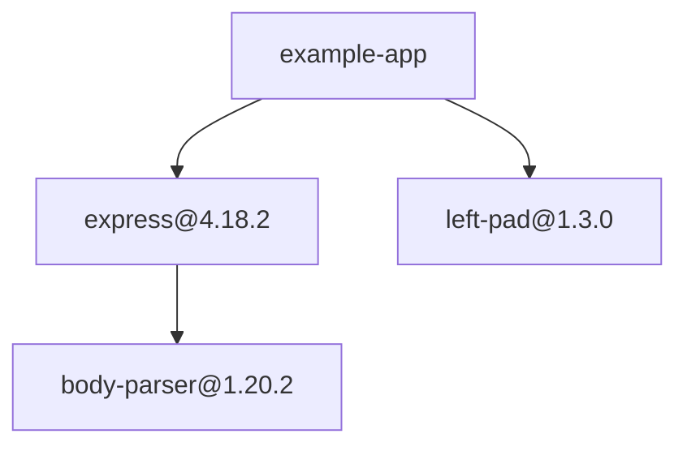

# Dependency Graph Markdown Report

## Purpose

Add an optional report export that visually explains the dependency graph
discovered by the auditor. The exported Markdown document would complement the
existing terminal summary; it would not change job processing, PostgreSQL
durability, retries, the DLQ, or graceful shutdown.

## Proposed Output

The generated Markdown report could contain:

- an audit summary;
- a table of discovered packages and licenses;
- policy violations and their paths from the root project;
- a Mermaid diagram showing package-to-package dependencies.

Example:

````markdown
# Dependency Audit Report

## Summary

- Packages scanned: 12
- Policy violations: 1

## Dependency Graph



## Policy Violations

| Package | License | Dependency path |
|---|---|---|
| `left-pad@1.3.0` | `WTFPL` | `example-app → left-pad@1.3.0` |
````

## Main Design Decision

The main design decision is whether the Markdown file should contain the complete dependency graph or only the paths that lead to policy violations.

### Complete graph

Advantages:

- Shows the full dependency structure.
- Makes shared and transitive dependencies visible.
- Provides a useful architecture artifact for small and medium projects.

Tradeoffs:

- Large projects could produce diagrams that are difficult to read.
- Mermaid rendering may become slow for very large dependency graphs.
- Important violations may be visually buried among unrelated packages.

### Violation-only graph

Advantages:

- Keeps the report focused and readable.
- Clearly explains why each violating package is present.
- Produces a smaller artifact for reviews and pull requests.

Tradeoffs:

- Does not provide a complete representation of the audited project.
- Omits clean branches that may still be useful for understanding the system.

An optional report mode could eventually support both forms, but the initial
implementation should choose one explicit default.

## Proposed Implementation Boundary

A future implementation would remain within the reporting layer:

1. Read snapshots from the existing package and edge stores after the audit
   finishes.
2. Convert package names and versions into stable Mermaid node identifiers.
3. Preserve the original package coordinates as visible node labels.
4. Deduplicate repeated edges caused by dependency diamonds.
5. Render the summary, package table, violation paths, and Mermaid graph as
   Markdown.
6. Write the result to a user-selected output path.

No queue, worker-pool, retry, DLQ, or database schema changes should be needed.

## Possible CLI Shape

```bash
go run ./cmd/auditor --output audit-report.md ./package.json
```

The current terminal report could remain the default when no output path is
provided.

## Testing Considerations

Focused tests should cover:

- empty dependency graphs;
- direct and transitive dependencies;
- shared dependencies and duplicate edges;
- cyclic graphs;
- scoped npm package names and other Mermaid-sensitive characters;
- policy-violation paths;
- deterministic output ordering.

## Out of Scope

- Interactive HTML graph viewers
- Graph images or PDF generation
- Source-file or feature-file dependency analysis
- Persisting package nodes and dependency edges in new database tables
- Changes to queue execution or shutdown behavior
