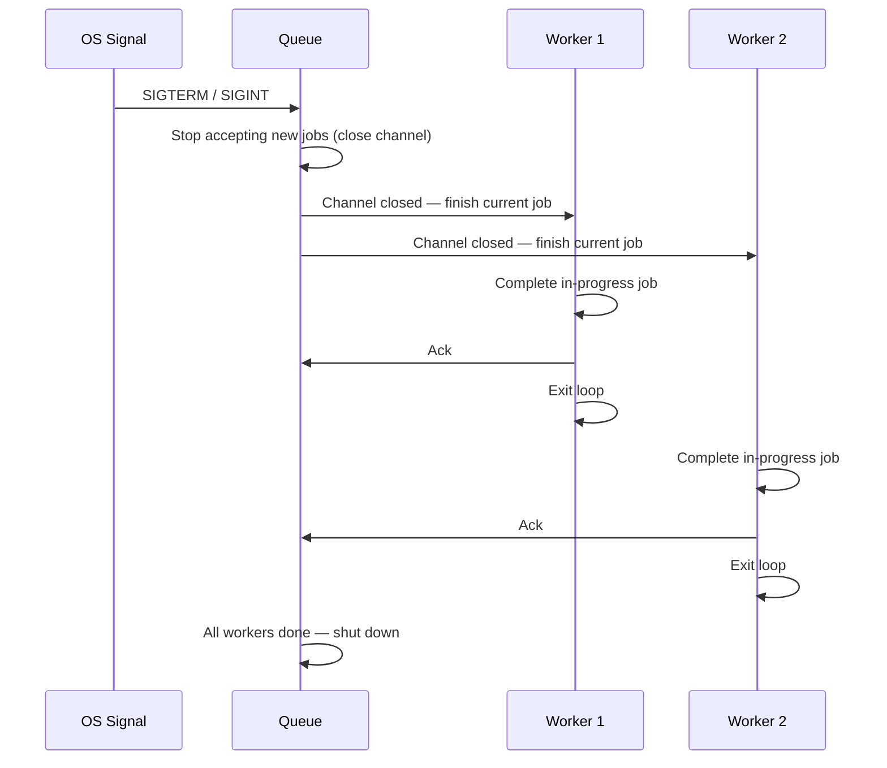

# Graceful Shutdown

Graceful shutdown ensures that stopping the system does not lose in-flight work. When the process receives a stop signal, it finishes what it's doing before exiting — bounded by a timeout so it can't hang forever.

---

## The Problem

Without graceful shutdown, stopping the system kills workers mid-job:

```
Worker is halfway through auditing express@4.18.2
    → process killed
    → HTTP response from registry is discarded
    → database update never happens
    → job is stuck in "Running" status with no worker handling it
```

On restart, crash recovery reclaims the job — but the work done so far is wasted. Every restart throws away in-progress work.

With graceful shutdown:

```
Worker is halfway through auditing express@4.18.2
    → stop signal received
    → worker finishes auditing express@4.18.2
    → worker acks the job
    → worker exits
    → process shuts down cleanly
```

No work is wasted. No jobs are orphaned.

---

## The Sequence



### Step by step

1. **Signal received** — the OS sends `SIGTERM` (normal stop) or `SIGINT` (Ctrl+C). The system catches this instead of dying immediately.

2. **Stop accepting new jobs** — the channel is closed. Producers can no longer submit. No new jobs enter the queue.

3. **Drain** — workers that are idle exit immediately (closed channel returns zero value). Workers that are mid-job finish their current job and then exit.

4. **Wait** — the system waits for all workers to finish and exit.

5. **Timeout** — if any worker hasn't finished within a deadline, force-exit. This prevents a single stuck job from hanging shutdown forever.

6. **Clean exit** — close the database connection pool, flush logs, exit with status 0.

---

## The Timeout

The timeout is the safety net. Without it, a single stuck worker (e.g., waiting on a network call that never returns) blocks shutdown indefinitely.

```
Shutdown initiated
    │
    ├── Worker 1 finishes in 2s ✅
    ├── Worker 2 finishes in 5s ✅
    └── Worker 3 is stuck on a hanging HTTP request...
        │
        ├── Without timeout: wait forever ❌
        └── With timeout (30s): force-kill after 30s ✅
```

The stuck job's status remains `Running` in Postgres. On the next startup, crash recovery reclaims it as `Pending` and it retries normally.

### Choosing the timeout

| Timeout | Effect |
|---|---|
| Too short (2s) | Workers doing legitimate slow work get killed mid-job — defeats the purpose of graceful shutdown |
| Just right (30s) | Long enough for any normal job to finish, short enough to not block deploys |
| Too long (10min) | A stuck worker holds up shutdown for 10 minutes — unacceptable for deploys or restarts |

The right value depends on how long your longest normal job takes. For the auditor (HTTP calls to a registry), 30 seconds is generous — most calls complete in under 1 second.

---

## Implementation in Go

Go provides the building blocks natively:

### Catching the signal

```go
ctx, stop := signal.NotifyContext(context.Background(), syscall.SIGTERM, syscall.SIGINT)
defer stop()
```

### Closing the channel

```go
close(jobQueue)  // workers' range loops exit when the channel is closed
```

### Waiting with a timeout

```go
done := make(chan struct{})
go func() {
    wg.Wait()     // wait for all workers to finish
    close(done)
}()

select {
case <-done:
    // all workers finished cleanly
case <-time.After(30 * time.Second):
    // timeout — force exit
}
```

The `sync.WaitGroup` (`wg`) tracks how many workers are still running. Each worker calls `wg.Done()` when it exits its loop.

---

## Design Decisions

### 1. Drain, not drop

**Decision:** On shutdown, let workers finish in-progress jobs instead of killing them immediately.

**Tradeoff:** Shutdown takes longer (up to the timeout duration), but no work is lost. Immediate kill is faster but wastes every in-progress job — the worker did work, hit the network, used resources, and the result is thrown away.

### 2. Timeout as a hard ceiling

**Decision:** If workers don't finish within the timeout, force-exit anyway.

**Tradeoff:** A stuck job's work is lost, but the system shuts down. The alternative — waiting indefinitely — means a single bad job can prevent restarts, deploys, and scaling operations. The lost job is reclaimed on the next startup by crash recovery, so it's not permanently lost — just delayed.

### 3. Close channel to signal workers, not a separate flag

**Decision:** Closing the Go channel is the shutdown signal to workers. When the channel is closed, `range` loops exit naturally.

**Tradeoff:** Clean and idiomatic in Go — no separate "stop" boolean that workers have to check. But it's a one-shot signal: once the channel is closed, it cannot be reopened. This is fine because shutdown is a one-shot event.
