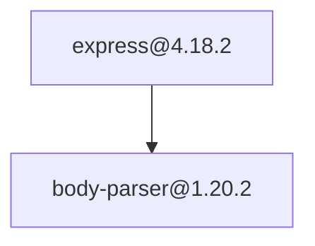
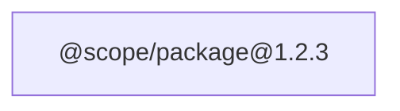

# Feature Implementation — Dependency Graph Markdown Report

## Status

Proposed post-MVP feature. This document defines the implementation boundary;
it does not change the current auditor.

## Goal

Add an optional Markdown artifact that explains the dependency audit visually.
The file will contain the existing audit summary, package information, policy
violations, dependency paths, and a Mermaid dependency graph.

The terminal report remains supported and unchanged when no output file is
requested.

## Design Decision

The main design decision is whether the Markdown file should contain the complete dependency graph or only the paths that lead to policy violations.

The initial implementation will render the **complete graph available in the
existing package and edge stores**. A violation-only rendering mode is deferred
until there is evidence that complete graphs are too large for typical audits.

The renderer must not invent relationships. It will display the nodes and edges
currently captured by the auditor, including isolated package nodes, but it will
not infer missing root or dependency edges.

## Scope

### In scope

| Concern | Required behavior |
|---|---|
| Markdown export | Write one UTF-8 Markdown document after a successful audit |
| Existing report | Include the current summary and policy-violation information |
| Package table | List discovered package, version, license, and verdict values |
| Mermaid graph | Render every package and dependency edge available in the current stores |
| Determinism | Sort packages and edges so identical input produces identical output |
| Safe Mermaid output | Handle scoped package names, punctuation, quotes, and repeated edges |
| CLI option | Accept an optional output path while preserving the existing positional input |
| Error handling | Return a clear non-zero CLI result if report generation or writing fails |
| Tests | Cover rendering, escaping, ordering, cycles, duplicate edges, and CLI parsing |

### Out of scope

- Violation-only graph mode
- Interactive HTML graphs
- PNG, SVG, or PDF generation
- Source-file, feature-file, or import graph analysis
- New PostgreSQL tables or migrations
- Persisting `Package` or `DependencyEdge` records
- Changes to queue, worker, retry, DLQ, or shutdown semantics
- Uploading or publishing reports
- Styling systems or configurable Markdown templates

## Proposed CLI Contract

Existing behavior remains valid:

```bash
go run ./cmd/auditor ./package.json
```

Markdown export is requested explicitly:

```bash
go run ./cmd/auditor --output audit-report.md ./package.json
```

Rules:

- `--output` is optional;
- exactly one `package.json` path remains required;
- an empty `--output` value is invalid;
- the CLI does not require a `.md` extension;
- without `--output`, no file is created;
- the existing terminal summary is still printed when `--output` is used;
- file-generation failures are reported clearly and produce a non-zero exit.

## Output Contract

The Markdown document will use this stable section order:

1. Title
2. Audit summary
3. Dependency graph
4. Package inventory
5. Policy violations

Example shape:

````markdown
# Dependency Audit Report

## Summary

- Root: `example-app`
- Packages scanned: 12
- Policy violations: 1

## Dependency Graph



## Packages

| Package | Version | License | Verdict |
|---|---|---|---|
| `express` | `4.18.2` | `MIT` | `pass` |

## Policy Violations

| Package | License | Dependency path |
|---|---|---|
| `left-pad@1.3.0` | `WTFPL` | `example-app → left-pad@1.3.0` |
````

## Component Changes

```text
cmd/auditor/
├── main.go                         ← parse --output and write the artifact
└── main_test.go                    ← CLI argument and output-error tests
internal/auditor/
├── markdown.go                     ← deterministic Markdown/Mermaid renderer
└── markdown_test.go                ← focused renderer tests
```

No existing storage or execution component changes.

## Markdown Renderer

Add a renderer in `internal/auditor/markdown.go`. It should accept snapshots of
the data already produced by an audit rather than reading PostgreSQL or invoking
the registry.

A suitable API boundary is:

```go
type MarkdownReportInput struct {
    Root     string
    Packages []Package
    Edges    []DependencyEdge
    Report   *Report
}

func GenerateMarkdownReport(input MarkdownReportInput) (string, error)
```

The exact name may change during implementation, but the responsibilities must
remain separated:

- the renderer converts existing data to Markdown;
- the CLI owns argument parsing and file writing;
- the handler continues to discover packages and edges;
- the worker pool remains unaware of report formats.

## Deterministic Rendering

Map iteration order must never affect the generated file.

Before rendering:

1. Copy package and edge snapshots.
2. Sort packages by name, then version.
3. Sort edges by parent name, parent version, child name, then child version.
4. Remove exact duplicate edges using the full four-field edge identity.
5. Assign Mermaid node identifiers in sorted order.

Deterministic output keeps tests stable and produces reviewable Git diffs.

## Mermaid Node Rules

Package coordinates must not be used directly as Mermaid identifiers because
names such as `@scope/package` contain syntax-sensitive characters.

Use generated identifiers such as `n0`, `n1`, and `n2`, while keeping the real
coordinate in a quoted label:



Renderer rules:

- identify a node by the full `name@version` coordinate;
- escape backslashes, double quotes, and line breaks in labels;
- create nodes for edge endpoints even when no matching `Package` snapshot is
  available;
- emit isolated package nodes;
- emit each exact dependency edge once;
- allow cycles without recursively walking the graph during rendering.

## Markdown Table Rules

Escape Markdown table-sensitive content:

- replace `|` in cell values with `\|`;
- replace line breaks with spaces;
- render empty license values as `Not declared`;
- preserve package names and versions as inline code where possible.

Package rows use the deterministic package ordering. Violation rows use the
same ordering so the graph, inventory, and violation sections remain stable.

## CLI Integration

The CLI change is limited to report output orchestration:

1. Parse the optional `--output` argument and required `package.json` path.
2. Run the existing audit without changing its lifecycle.
3. Generate the existing terminal report.
4. If `--output` was supplied, snapshot `PackageStore` and `EdgeStore`.
5. Generate Markdown from those snapshots and the existing report.
6. Write the Markdown document to the requested path.
7. Print the existing terminal summary.

The report must only be written after `Pool.Shutdown` returns successfully. A
shutdown timeout must retain the existing non-zero exit behavior and must not
produce a misleading final report.

## Error Handling

Return clear errors for:

- missing `package.json` path;
- missing value after `--output`;
- unexpected extra positional arguments;
- renderer validation failures;
- an output path that cannot be created or written;
- a short or failed file write.

Errors should identify the output path where relevant. The renderer must return
errors rather than logging or exiting; the CLI retains ownership of exit policy.

## Testing Strategy

### Renderer unit tests

| Test | Verification |
|---|---|
| Empty graph | Produces all required sections without invalid Mermaid syntax |
| Single package | Emits one node and one package row |
| Direct and transitive graph | Emits all stored edges |
| Dependency diamond | Shared node is emitted once; distinct edges remain |
| Duplicate edge | Exact duplicate edge is emitted once |
| Cycle | Both directions render without recursion or hanging |
| Scoped package | Mermaid identifier remains safe and label remains readable |
| Escaping | Quotes, pipes, backslashes, and line breaks do not break output |
| Isolated package | Package appears even when it has no edges |
| Missing endpoint metadata | Edge endpoint still receives a Mermaid node |
| Determinism | Different input ordering produces byte-identical Markdown |
| Violations | Violation table includes license and dependency path |

### CLI tests

| Test | Verification |
|---|---|
| No output option | Existing CLI argument behavior remains unchanged |
| Output option | Path is parsed and the Markdown file is written |
| Missing output value | Clear configuration error |
| Unwritable path | Non-zero result with path-specific error |
| Shutdown failure | No final Markdown artifact is reported as successful |

Tests should use temporary directories and deterministic in-memory graph data.
They must not require npm or PostgreSQL. Existing race and integration suites
must continue to pass unchanged.

## Validation Commands

```bash
go test -race ./internal/auditor ./cmd/auditor
go test -race ./...
go test -race -tags=integration ./...
```

The PostgreSQL integration command verifies that adding an optional output path
does not regress the existing durable queue and shutdown behavior; this feature
does not add new database integration cases.

## Implementation Order

1. Add deterministic sorting and escaping helpers in the Markdown renderer.
2. Render the Mermaid graph from package and edge snapshots.
3. Render summary, package, and violation sections.
4. Add renderer unit tests.
5. Add optional CLI output argument parsing.
6. Write the generated document after successful pool shutdown.
7. Add focused CLI tests.
8. Run the existing unit, race, and integration suites.

## Exit Criteria

The feature is complete when:

- [ ] Running without `--output` behaves exactly as before.
- [ ] `--output <path>` creates a readable Markdown audit report.
- [ ] The report contains summary, graph, package, and violation sections.
- [ ] Every package and edge present in the current stores is represented.
- [ ] Mermaid output handles scoped and syntax-sensitive package names.
- [ ] Duplicate edges are removed and cycles render safely.
- [ ] Output is deterministic across repeated runs with identical data.
- [ ] File and argument errors are clear and produce a non-zero CLI result.
- [ ] No report is written after a shutdown timeout.
- [ ] `go test -race ./...` passes.
- [ ] `go test -race -tags=integration ./...` passes against PostgreSQL.
