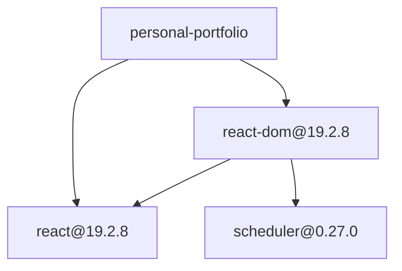

# Feature Implementation — Resolved Dependency Graph Mapping

## Status

Proposed correction to dependency edge capture. The Markdown renderer already
renders the graph stored by the auditor; this change makes that stored graph
represent resolved package-to-package relationships.

## Goal

Produce one connected dependency graph whose nodes are audited packages at
exact resolved versions and whose edges represent actual parent-to-child
relationships.

For example:



## Current Behavior

The existing implementation already provides:

- `package.json` dependency parsing;
- npm range resolution;
- exact package metadata in `PackageStore`;
- dependency storage in `EdgeStore`;
- dependency-path generation;
- deterministic Markdown and Mermaid rendering.

The graph is currently disconnected because:

1. Seed jobs do not identify the root project as their parent.
2. The handler stores child version ranges in edges before those ranges are
   resolved.
3. A requested node such as `scheduler@^0.27.0` and its audited package
   `scheduler@0.27.0` become separate Mermaid nodes.
4. The current pre-resolution `PackageStore.Exists` check compares requested
   ranges with exact stored versions and cannot reliably deduplicate them.

The renderer is not responsible for correcting these relationships. It must
continue to display only the package and edge snapshots supplied to it.

## Scope

### In scope

- Carry the parent coordinate in each audit job.
- Add root-to-direct-dependency edges.
- Store dependency edges only after the child resolves to an exact version.
- Preserve all incoming edges in diamond and shared-dependency graphs.
- Keep package expansion deduplicated by exact package coordinate.
- Produce root-based dependency paths for policy violations.
- Add focused handler, report, and renderer tests.

### Out of scope

- Markdown renderer redesign.
- Mermaid styling or interactive output.
- Dependency-type labels for production versus development dependencies.
- Changes to PostgreSQL schemas or migrations.
- Persisting package or edge stores.
- Queue, worker, retry, DLQ, or shutdown changes.
- Registry caching or request coalescing.
- Lockfile parsing or npm installation semantics.

## Data Contract

Extend `AuditPayload` with the coordinate of the package that declared the
requested dependency:

```go
type AuditPayload struct {
    Name          string `json:"name"`
    Version       string `json:"version"`
    ParentName    string `json:"parent_name,omitempty"`
    ParentVersion string `json:"parent_version,omitempty"`
}
```

`Name` and `Version` remain the requested child package and version range.
`ParentName` and `ParentVersion` identify the already-resolved parent.

The optional JSON fields preserve compatibility with durable jobs created
before this change. A payload without `parent_name` remains valid but cannot
produce an incoming edge.

## Root Job Seeding

The CLI will identify the project root as the parent of every direct dependency:

```go
auditor.AuditPayload{
    Name:          dependency.Name,
    Version:       dependency.VersionRange,
    ParentName:    rootName,
    ParentVersion: "",
}
```

The root project does not need a `PackageStore` record. The renderer already
creates Mermaid nodes for edge endpoints without matching package metadata.

Both production and development dependencies remain included, matching the
existing `ParsePackageJSON(path, true)` behavior.

## Handler Flow

For each audit job:

1. Decode the requested package, range, and parent coordinate.
2. Resolve and fetch the requested package metadata.
3. Record the incoming edge using the resolved child coordinate.
4. Evaluate and store the resolved package.
5. If the package was already stored, stop expansion after preserving the
   incoming edge.
6. Create child jobs carrying the resolved current package as their parent.

The incoming edge must be recorded before the `PackageStore.Add` deduplication
return. This preserves both sides of a diamond:

```text
left@1.0.0  ──→ shared@3.0.0
right@2.0.0 ──→ shared@3.0.0
```

The edge will be created as follows:

```go
if payload.ParentName != "" {
    edgeStore.Add(DependencyEdge{
        FromName:    payload.ParentName,
        FromVersion: payload.ParentVersion,
        ToName:      metadata.Name,
        ToVersion:   metadata.Version,
    })
}
```

Child jobs will carry the current resolved coordinate:

```go
AuditPayload{
    Name:          dependencyName,
    Version:       dependencyRange,
    ParentName:    metadata.Name,
    ParentVersion: metadata.Version,
}
```

## Deduplication

Remove the pre-resolution check:

```go
packageStore.Exists(dependencyName, dependencyRange)
```

The requested range is not an exact package identity. Different ranges may
resolve to the same version, while identical ranges can occur under multiple
parents whose edges must all be retained.

Child jobs may therefore perform duplicate registry resolution. Exact package
expansion remains deduplicated by `PackageStore.Add` after resolution. Registry
request coalescing is a separate optimization and is not part of this change.

Exact duplicate edges may remain in `EdgeStore`; the Markdown renderer already
sorts and removes exact duplicates deterministically.

## Expected Graph Invariants

After a successful audit:

- every package inventory row has one corresponding exact-version graph node;
- the root node has an edge to every resolved direct dependency;
- every stored edge points to an exact resolved child coordinate;
- no edge endpoint is a semver-range placeholder;
- shared dependencies retain an incoming edge from every declaring parent;
- cycles remain valid directed edges;
- violation paths begin at the root when the dependency is reachable;
- the renderer does not invent or resolve relationships.

Edge-only nodes remain possible when metadata resolution succeeds and the
package snapshot is otherwise unavailable, but version-range placeholders are
not expected from the normal handler flow.

## Component Changes

```text
cmd/auditor/
├── main.go                         ← seed direct jobs with the root parent
└── main_test.go                    ← verify seeded payload parent data
internal/auditor/
├── handler.go                      ← record incoming resolved edges
├── handler_test.go                 ← exact edge, diamond, and dedup tests
├── report_test.go                  ← verify root-based violation paths
└── markdown_test.go                ← verify no range-placeholder nodes
```

No renderer, storage schema, or execution component changes are required.

## Testing Strategy

### Handler tests

| Test | Verification |
|---|---|
| Root dependency | Resolved child receives an edge from the root |
| Transitive dependency | Resolved parent points to the exact resolved child |
| Range replacement | Raw requested range does not appear in `EdgeStore` |
| Dependency diamond | Both parents retain edges to the shared exact package |
| Duplicate package | Incoming edge is stored while child expansion runs once |
| Legacy payload | Missing parent fields remain valid and do not add an edge |

### Report and renderer tests

| Test | Verification |
|---|---|
| Root path | Policy-violation path begins at the project root |
| Exact nodes | Graph nodes use resolved package versions |
| No placeholders | Mermaid output contains no requested range as a node |
| Determinism | Reordered exact packages and edges produce identical output |

### Validation commands

```bash
go test -race ./internal/auditor ./cmd/auditor
go test -race ./...
go test -race -tags=integration ./...
```

Run the portfolio fixture against an isolated PostgreSQL database and verify
that the Mermaid graph contains root edges and exact-version endpoints.

## Exit Criteria

- [ ] Direct dependencies are connected to the root project.
- [ ] Transitive edges connect exact resolved package coordinates.
- [ ] Semver ranges do not appear as graph-node versions in normal audits.
- [ ] Diamond dependencies preserve every distinct parent edge.
- [ ] Exact package expansion occurs once.
- [ ] Policy-violation paths start at the root when reachable.
- [ ] Existing payloads without parent fields remain processable.
- [ ] The Markdown renderer remains unchanged.
- [ ] No database migration is added.
- [ ] `go test -race ./...` passes.
- [ ] `go test -race -tags=integration ./...` passes against PostgreSQL.
