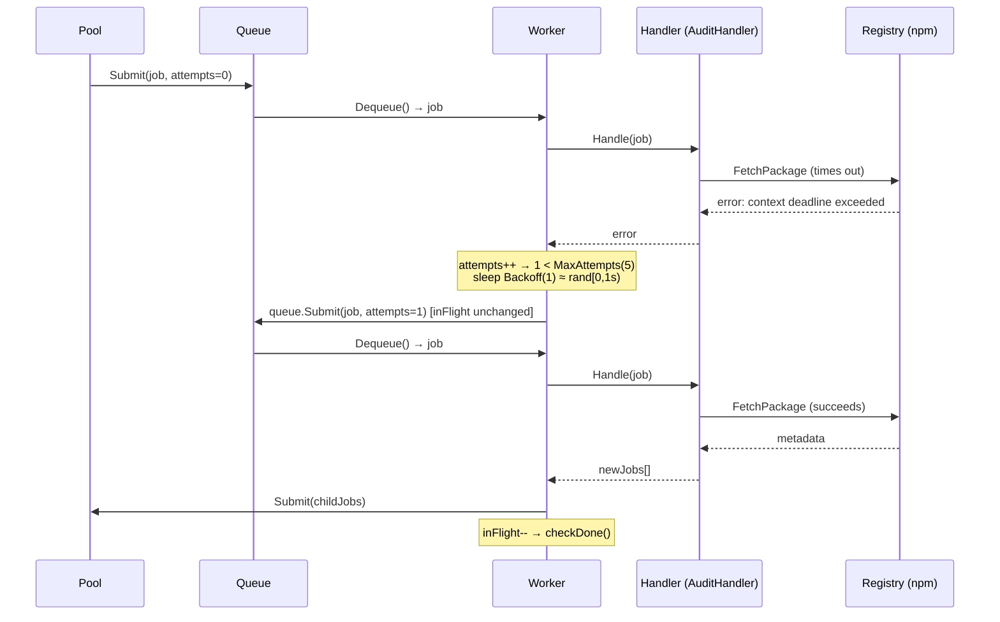

# Phase 2 — Retries with Exponential Backoff + Jitter

Phase 2 hardens the worker pool against transient failures. When a handler
returns an error, the job is retried after a computed delay rather than being
silently discarded. After a capped number of attempts the job is logged and
dropped — Phase 3 will move those exhausted jobs into a dead-letter queue
instead.

> **What's proven at the end of Phase 2:**
> Registry timeouts, 5xx responses, and rate-limit rejections are absorbed
> without losing subtrees of the dependency graph. A brief outage causes
> delayed retries, not silent data loss.

---

## Scope

### In scope

| Concern | Detail |
|---|---|
| **`Attempts` field on Job** | Track how many times a job has been tried |
| **`MaxAttempts` constant** | Cap on total tries before the job is abandoned |
| **Backoff calculation** | `baseDelay × 2^attempt` — delay doubles each retry |
| **Full jitter** | `rand(0, backoff)` — randomises each delay to break thundering herds |
| **Retry in the worker loop** | Worker sleeps for the jittered delay, then re-queues the job without touching the inFlight counter |
| **Exhausted job handling** | After `MaxAttempts`, log the failure and decrement inFlight (Phase 3 upgrades this to DLQ) |

### Out of scope (later phases)

| Concern | Phase |
|---|---|
| Dead-letter queue for exhausted jobs | Phase 3 |
| `ScheduledAt` timestamp + Postgres | Phase 4 (durable backoff that survives crashes) |
| Graceful shutdown with drain + timeout | Phase 5 |

---

## What Changes From Phase 1

Only two existing components are modified. Everything else — the queue, the
auditor handler, the stores, the report, semver, depfile — is untouched.

| Component | Change |
|---|---|
| `internal/job/job.go` | Add `Attempts int` and `MaxAttempts int` fields to `Job` |
| `internal/worker/pool.go` | Replace the Phase 1 "log and continue" error path with the retry loop |

A new helper function for backoff calculation lives in the worker package and
is exported so it can be tested in isolation.

---

## Project Layout

```
internal/
├── job/
│   └── job.go            ← [MODIFY] add Attempts + MaxAttempts fields
└── worker/
    ├── pool.go            ← [MODIFY] retry loop replaces log-and-continue
    └── backoff.go         ← [NEW] Backoff(attempt int) time.Duration helper
```

---

## Component Specifications

### 1. Job struct update (`internal/job/job.go`)

```go
type Job struct {
    ID          string
    Type        string
    Payload     json.RawMessage
    Status      Status
    Attempts    int  // how many times this job has been tried (0 = never run)
    MaxAttempts int  // maximum tries before the job is abandoned
}
```

**`Attempts`** is incremented by the worker loop before each retry, so a job
with `Attempts == 1` has failed once and is about to be retried for the first
time.

**`MaxAttempts`** is set by the caller when the job is created. The default
for auditor jobs is `5`. Setting it to `0` or `1` means no retries.

A convenience constructor sets the default:

```go
const DefaultMaxAttempts = 5

func NewJob(jobType string, payload json.RawMessage) Job {
    return Job{
        ID:          NewJobID(),
        Type:        jobType,
        Payload:     payload,
        Status:      StatusPending,
        MaxAttempts: DefaultMaxAttempts,
    }
}
```

---

### 2. Backoff helper (`internal/worker/backoff.go`)

Pure function — no I/O, no state, safe for concurrent use.

```go
// Backoff returns the jittered sleep duration for the given attempt number.
// attempt is 1-indexed: attempt=1 is the first retry after an initial failure.
//
// Formula: rand(0, min(maxDelay, baseDelay × 2^(attempt-1)))
//
// Constants:
//   baseDelay = 1 second
//   maxDelay  = 30 seconds  (cap so long-running retries don't wait forever)
func Backoff(attempt int) time.Duration
```

#### Backoff table (expected ranges)

| Attempt (retry #) | Window | Example durations |
|:---:|:---|:---|
| 1 | `[0s, 1s)` | 0.4s, 0.9s, 0.1s |
| 2 | `[0s, 2s)` | 1.7s, 0.3s, 1.4s |
| 3 | `[0s, 4s)` | 3.1s, 0.8s, 2.9s |
| 4 | `[0s, 8s)` | 6.2s, 1.1s, 7.8s |
| 5+ | `[0s, 30s)` | capped at 30s window |

#### Why full jitter, not additive jitter?

The AWS "Exponential Backoff and Jitter" recommendation uses **full jitter**:
`sleep = rand(0, cap)` rather than `sleep = cap + rand(-jitter, +jitter)`.

Full jitter means some retries happen very quickly (near zero delay) and some
near the cap. Across a fleet of jobs that all failed simultaneously, the retries
are spread uniformly across the window — which is the best possible distribution
for avoiding a thundering herd. Additive jitter only perturbs the top of the
window, so retries can still cluster.

---

### 3. Worker pool update (`internal/worker/pool.go`)

The `workerLoop` error path changes from:

```go
// Phase 1 (before)
if err != nil {
    log.Printf("worker %d: job %s failed: %v", id, j.ID, err)
    p.inFlight.Add(-1)
    p.checkDone()
    continue
}
```

To:

```go
// Phase 2 (after)
if err != nil {
    j.Attempts++
    if j.Attempts < j.MaxAttempts {
        delay := Backoff(j.Attempts)
        log.Printf("worker %d: job %s failed (attempt %d/%d), retrying in %v: %v",
            id, j.ID, j.Attempts, j.MaxAttempts, delay, err)
        time.Sleep(delay)
        p.queue.Submit(j)  // re-queue directly — inFlight counter is unchanged
        continue
    }
    // Attempts exhausted.
    log.Printf("worker %d: job %s exhausted after %d attempts: %v",
        id, j.ID, j.Attempts, err)
    p.inFlight.Add(-1)
    p.checkDone()
    continue
}
```

#### Key design decisions

**inFlight counter on retry:** The counter is *not* modified when a job is
retried. The job was already counted when it was first submitted
(`pool.Submit` increments it). Re-queuing via `queue.Submit` directly
(bypassing `pool.Submit`) keeps the counter stable. The counter only
decrements when a job is either completed successfully or has exhausted all
attempts.

**Worker sleeps during backoff:** The goroutine sleeps for the jitter delay
before re-queuing. This is the correct choice for Phase 2:

- Simple — no extra goroutines or timers.
- The goroutine is idle during the wait, consuming only its stack. In a pool
  of 10 workers, a few sleeping goroutines during backoff is not a problem.

Phase 4 upgrades this to a `ScheduledAt` timestamp in Postgres so the delay
survives a crash. For an in-memory Phase 2 system, sleep-then-requeue is
correct.

**Handler remains unaware of retries:** The `Handler` interface signature is
unchanged. Retry logic is entirely the worker loop's responsibility. The
handler just returns an error; it never sees the attempt count.

---

## Retry Flow (End-to-End)



---

## Testing Strategy

### Unit tests

| Component | What's tested |
|---|---|
| `Backoff` | Attempt 1 returns `[0, 1s)`. Attempt 5 returns `[0, 30s)`. Two calls with the same attempt return different values (probabilistic, seeded). Never returns negative. |
| `Pool` (retry path) | A handler that fails N times then succeeds: job completes, Done fires, correct attempt count. |
| `Pool` (exhausted) | A handler that always fails: Done fires after `MaxAttempts` attempts, inFlight reaches zero. |
| `Job` constructor | `NewJob` sets `MaxAttempts = DefaultMaxAttempts`, `Attempts = 0`, valid ID. |

### What is NOT tested

- Real sleep durations — tests use a mock clock or a `BackoffFunc` injectable
  so the test suite doesn't block for seconds.
- The thundering herd property of full jitter — this requires statistical
  analysis, not a unit test.

### Making the pool testable with fake backoff

The pool should accept a `BackoffFunc` so tests can inject a zero-delay
function:

```go
type Pool struct {
    // ...
    backoff func(attempt int) time.Duration  // injectable; defaults to Backoff
}

// In tests:
pool := worker.NewWithOptions(size, q, h, worker.WithBackoff(func(int) time.Duration {
    return 0  // no sleep in tests
}))
```

This keeps the test suite fast without changing the production behaviour.

---

## Exit Criteria

Phase 2 is done when:

- [ ] A handler that returns a transient error on the first two attempts and
      succeeds on the third: job completes, `Done` fires, report is correct
- [ ] A handler that always fails: job is logged as exhausted after
      `MaxAttempts` attempts and `Done` fires cleanly
- [ ] `Backoff(attempt)` always returns a non-negative duration
- [ ] Two jobs that fail simultaneously retry at different times (verified by
      logging different sleep durations)
- [ ] `go test -race ./...` passes — no races in the retry path
- [ ] The auditor smoke test still passes end-to-end with real npm (retry
      logic is transparent when no errors occur)
