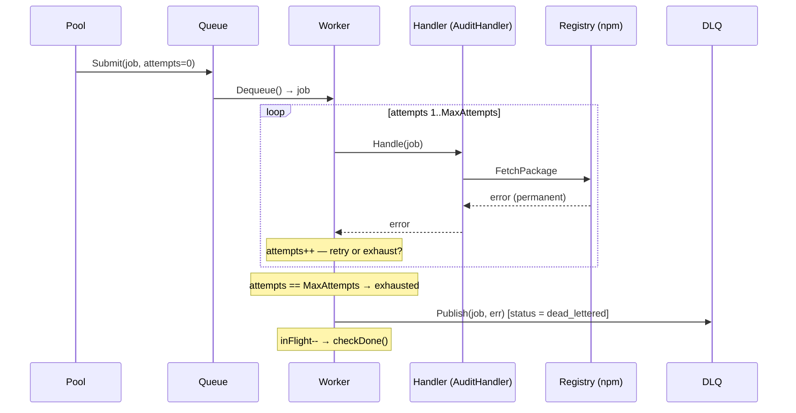

# Phase 3 — Dead-Letter Queue (DLQ)

Phase 3 upgrades the exhausted-job path from "log and drop" to "log and
quarantine". When a job exhausts all of its retry attempts it is moved into a
dead-letter queue instead of being silently discarded. The DLQ is an in-memory
store for now — Phase 4 will back it with Postgres so entries survive crashes.

> **What's proven at the end of Phase 3:**
> Packages that are permanently unresolvable (removed from the registry,
> malformed metadata, persistent 5xx) are quarantined with a full record of
> their failure. The audit completes cleanly and the report lists every
> dead-lettered package rather than silently omitting it.

---

## Scope

### In scope

| Concern | Detail |
|---|---|
| **`DLQ` type** | A thread-safe in-memory store for exhausted jobs |
| **`DLQEntry` struct** | Wraps the exhausted `Job` with the final error string and a timestamp |
| **Worker pool wiring** | Pool receives a `*DLQ`; exhausted jobs are `Publish`-ed instead of dropped |
| **`DLQ.Entries()`** | Snapshot accessor — returns a copy of all dead-lettered entries |
| **`StatusDeadLettered`** | New `Job.Status` value to mark exhausted jobs |

### Out of scope (later phases)

| Concern | Phase |
|---|---|
| Postgres-backed DLQ persistence | Phase 4 |
| DLQ replay / requeue API | Phase 4+ |
| `ScheduledAt` timestamp + durable backoff | Phase 4 |
| Graceful shutdown with drain + timeout | Phase 5 |

---

## What Changes From Phase 2

Only two existing components are modified. Everything else — the queue, the
backoff helper, the auditor handler, the stores, the report, semver, depfile —
is untouched.

| Component | Change |
|---|---|
| `internal/job/job.go` | Add `StatusDeadLettered` constant |
| `internal/worker/pool.go` | Accept `*dlq.DLQ`; replace log-and-drop with `dlq.Publish` on exhaustion |

A new package provides the DLQ type and is the only new code.

---

## Project Layout

```
internal/
├── dlq/
│   └── dlq.go             ← [NEW] DLQ type, DLQEntry, Publish, Entries
├── job/
│   └── job.go             ← [MODIFY] add StatusDeadLettered
└── worker/
    └── pool.go            ← [MODIFY] wire DLQ; publish exhausted jobs
```

---

## Component Specifications

### 1. Job status update (`internal/job/job.go`)

A single constant is added to the existing `Status` block:

```go
const (
    StatusPending      Status = "pending"
    StatusRunning      Status = "running"
    StatusCompleted    Status = "completed"
    StatusDeadLettered Status = "dead_lettered"  // ← NEW
)
```

The worker sets `j.Status = job.StatusDeadLettered` before publishing to the
DLQ, mirroring how it sets `StatusRunning` and `StatusCompleted` today.

---

### 2. DLQ package (`internal/dlq/dlq.go`)

Pure in-memory, goroutine-safe. No I/O.

```go
// DLQEntry records an exhausted job and the reason it was dead-lettered.
type DLQEntry struct {
    Job       job.Job
    Err       string    // final error message
    DeadAt    time.Time // wall-clock time the job was quarantined
}

// DLQ is a thread-safe store for exhausted jobs.
type DLQ struct {
    mu      sync.Mutex
    entries []DLQEntry
}

// Publish appends an entry to the DLQ. Safe for concurrent use.
func (d *DLQ) Publish(j job.Job, err error)

// Entries returns a snapshot copy of all dead-lettered entries.
// The caller receives its own slice; mutations do not affect the DLQ.
func (d *DLQ) Entries() []DLQEntry
```

#### Why a copy in `Entries()`?

The DLQ is written to by multiple worker goroutines concurrently. Returning a
slice of the internal backing array would expose the caller to data races as
new entries are appended. A snapshot copy is a single allocation, and the DLQ
is only read for reporting — not in the hot path.

---

### 3. Worker pool update (`internal/worker/pool.go`)

The `Pool` struct gains one field and the exhausted path changes from:

```go
// Phase 2 (before)
// Attempts exhausted — log and release.
log.Printf("worker %d: job %s exhausted after %d attempts: %v",
    id, j.ID, j.Attempts, err)
p.inFlight.Add(-1)
p.checkDone()
continue
```

To:

```go
// Phase 3 (after)
// Attempts exhausted — quarantine in DLQ and release.
j.Status = job.StatusDeadLettered
p.dlq.Publish(j, err)
log.Printf("worker %d: job %s dead-lettered after %d attempts: %v",
    id, j.ID, j.Attempts, err)
p.inFlight.Add(-1)
p.checkDone()
continue
```

The `DLQ` is injected via a new functional option, keeping `New()` unchanged
for callers that don't need a DLQ:

```go
type Pool struct {
    // ...
    dlq *dlq.DLQ  // nil means exhausted jobs are only logged (Phase 2 behaviour)
}

// WithDLQ wires a DLQ into the pool. Exhausted jobs are published to it.
func WithDLQ(d *dlq.DLQ) Option {
    return func(p *Pool) { p.dlq = d }
}
```

When `p.dlq` is `nil` the pool falls back to the Phase 2 log-only behaviour,
so existing callers that don't pass `WithDLQ` are unaffected.

---

## DLQ Flow (End-to-End)



---

## Testing Strategy

### Unit tests

| Component | What's tested |
|---|---|
| `DLQ.Publish` | Entry is stored; `Entries()` returns it with correct job, error string, and non-zero `DeadAt` |
| `DLQ` (concurrent) | N goroutines publish simultaneously; `Entries()` returns exactly N entries, no races |
| `DLQ.Entries()` | Returned slice is a copy — mutating it does not affect the DLQ |
| `Pool` (DLQ wired) | Handler always fails; exhausted job appears in `dlq.Entries()`, `Done` fires, `inFlight` reaches zero |
| `Pool` (no DLQ) | Existing Phase 2 exhaustion behaviour unchanged when `WithDLQ` is not passed |
| `StatusDeadLettered` | Exhausted job has `Status == StatusDeadLettered` in the DLQ entry |

### What is NOT tested

- DLQ persistence — Phase 4 concern.
- DLQ replay / requeue — Phase 4+ concern.

### Making the DLQ testable

`DLQ` has no constructor arguments and no I/O — instantiate directly in tests:

```go
d := &dlq.DLQ{}
p := worker.NewWithOptions(size, q, h,
    worker.WithBackoff(noBackoff),
    worker.WithDLQ(d),
)
// ... run pool ...
entries := d.Entries()
```

---

## Exit Criteria

Phase 3 is done when:

- [ ] A handler that always fails: exhausted job appears in `dlq.Entries()` with
      the correct job ID and a non-empty error string
- [ ] Exhausted job has `Status == StatusDeadLettered`
- [ ] `Done` fires cleanly after exhaustion (inFlight reaches zero)
- [ ] N goroutines publishing to the DLQ concurrently: `go test -race ./...`
      passes and `Entries()` returns exactly N entries
- [ ] `Entries()` returns a copy — mutating the returned slice does not affect
      subsequent calls to `Entries()`
- [ ] Callers that do not pass `WithDLQ` still compile and behave as in Phase 2
- [ ] The auditor smoke test still passes end-to-end with real npm (DLQ is
      transparent when no jobs are exhausted)
