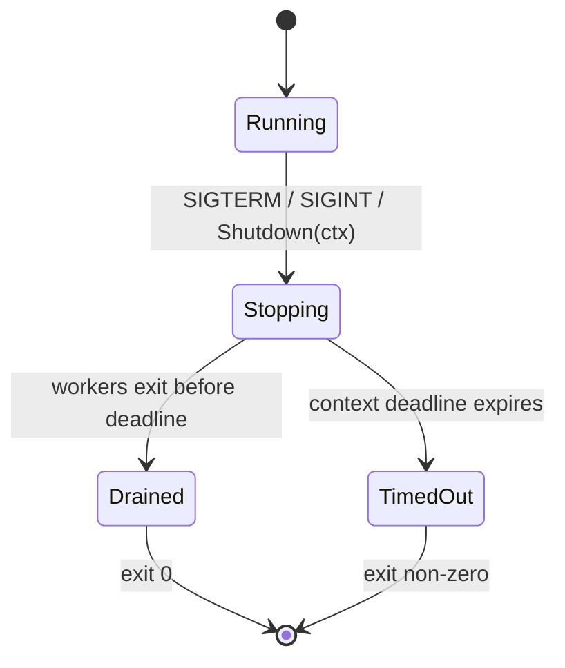

# Phase 5 — Graceful Shutdown (Drain + Timeout)

Phase 5 makes planned stops safe. When the auditor receives `SIGTERM` or
`SIGINT`, it stops accepting new external work, stops polling Postgres for more
jobs, lets work already handed to workers finish, and exits within a bounded
deadline. Work that cannot finish before the deadline remains durable and is
reclaimed by Phase 4 recovery on the next startup.

> **What's proven at the end of Phase 5:**
> A process receiving a normal stop signal completes work already in progress
> without accepting more external submissions. Shutdown finishes cleanly when
> workers drain before the deadline. If a worker is stuck, shutdown returns at
> the configured timeout and the unfinished `running` job is recovered as
> `pending` on restart.

---

## Prerequisite

Phase 5 builds directly on the Phase 4 durability guarantee:

- jobs and retry timestamps are stored in Postgres;
- exhausted jobs are stored in the durable DLQ;
- `running` jobs are reclaimed as `pending` on startup;
- the poller delivers pending jobs whose `scheduled_at` time has elapsed.

No schema change is required for Phase 5. The existing `jobs.status` state is
the restart boundary: cleanly completed jobs are `completed`; interrupted jobs
remain `running` and are reclaimed by the next process.

---

## Scope

### In scope

| Concern | Detail |
|---|---|
| **Signal handling** | Catch `SIGTERM` and `SIGINT` in the auditor CLI |
| **Submission gate** | Reject new external `Pool.Submit` calls after shutdown begins |
| **Poller stop** | Stop acquiring additional eligible jobs from Postgres before closing dispatch |
| **Safe queue close** | Closing and concurrent dispatch must never panic; close is idempotent |
| **Drain** | Workers finish jobs already running or already dispatched into the channel |
| **Self-feeding preservation** | Child jobs discovered during drain are persisted as `pending` for restart, not sent to the closing channel |
| **Bounded wait** | Wait for worker goroutines until a configurable shutdown deadline |
| **Timeout recovery** | On timeout, return control to the CLI; unfinished durable jobs are reclaimed on restart |
| **Exit behavior** | Exit successfully after a clean drain and non-zero after a forced timeout |

### Out of scope

| Concern | Phase |
|---|---|
| Horizontal scaling and coordinated multi-process shutdown | Post-Phase 5 |
| Rolling-deployment orchestration | Post-Phase 5 |
| DLQ replay / requeue API | Post-Phase 5 |
| Dynamic worker-pool resizing | Post-Phase 5 |
| Exactly-once delivery | Not a goal; delivery remains at-least-once |
| Kubernetes manifests, systemd units, or deployment scripts | Deployment concern |
| New database tables or migrations | Not required |

---

## What Changes From Phase 4

| Component | Change |
|---|---|
| `internal/queue/queue.go` | Make close idempotent and race-safe; reject dispatch after close; add a persist-without-dispatch path |
| `internal/worker/pool.go` | Add the submission gate, poller stop coordination, and `Shutdown(ctx)` |
| `cmd/auditor/main.go` | Catch OS signals, apply the shutdown timeout, and select normal completion versus shutdown |
| `.env.example` | Add optional `SHUTDOWN_TIMEOUT` with a `30s` default |
| Queue and pool tests | Add close/submit races, drain, timeout, and self-feeding shutdown coverage |
| Integration tests | Add real-signal clean-drain and timeout/restart tests against Postgres |

---

## Project Layout

```text
cmd/
└── auditor/
    ├── main.go                         ← [MODIFY] signal + timeout orchestration
    └── main_integration_test.go        ← [NEW] process-level signal tests
internal/
├── queue/
│   ├── queue.go                        ← [MODIFY] lifecycle-safe close/persist
│   └── queue_test.go                   ← [MODIFY] close and dispatch race tests
└── worker/
    ├── pool.go                         ← [MODIFY] Shutdown(ctx) lifecycle
    └── pool_test.go                    ← [MODIFY] drain and timeout tests
.env.example                            ← [MODIFY] SHUTDOWN_TIMEOUT
```

The Postgres store, schema, retry engine, and DLQ implementation do not change.

---

## Shutdown Contract

Shutdown is a one-way state transition:



Once the pool enters `Stopping`:

1. New external submissions return `ErrShuttingDown`.
2. The Postgres poller stops acquiring more jobs.
3. The pool waits until the poller has exited before closing dispatch, avoiding
   a send-on-closed-channel race.
4. The dispatch channel closes. Workers drain entries already buffered in the
   channel and finish their current handler call.
5. Child jobs discovered by a finishing handler are written to Postgres as
   `pending`, but are not dispatched in the stopping process.
6. The pool waits for worker goroutines, bounded by the caller's context.

Calling shutdown more than once must be safe. Every caller observes the same
terminal result; the queue and stop channels are closed at most once.

---

## Component Specifications

### 1. Queue lifecycle (`internal/queue/queue.go`)

The queue needs an explicit lifecycle because `close(ch)` racing with a sender
panics. Phase 5 must make these operations safe:

```go
var ErrClosed = errors.New("queue is closed")

// Submit persists and dispatches a job while the queue is open.
func (q *Queue) Submit(j job.Job) error

// Persist writes a pending job without dispatching it. Workers use this for
// children discovered after shutdown begins so restart can continue the graph.
func (q *Queue) Persist(ctx context.Context, j job.Job) error

// DispatchAcquired dispatches a store-acquired job only while open.
func (q *Queue) DispatchAcquired(j job.Job) error

// Close is idempotent and prevents all future channel sends.
func (q *Queue) Close()
```

The implementation may use a mutex plus `sync.Once`, or an equivalent
single-owner lifecycle mechanism. The required behavior is:

| Operation | Queue open | Queue closed |
|---|---|---|
| `Submit` | Persist, then dispatch | Return `ErrClosed`; do not dispatch |
| `Persist` | Persist only | Persist only |
| `DispatchAcquired` | Dispatch | Return `ErrClosed`; never panic |
| `Close` | Transition to closed | No-op |
| `Dequeue` | Return jobs normally | Drain buffered jobs, then return `ok=false` |

`Persist` exists specifically for durable self-feeding work. It is not a way
for external producers to bypass the pool's shutdown gate.

### 2. Worker pool lifecycle (`internal/worker/pool.go`)

The pool owns the ordering between poller shutdown, queue closure, and worker
drain:

```go
var ErrShuttingDown = errors.New("worker pool is shutting down")

// Submit rejects external work after shutdown begins.
func (p *Pool) Submit(j job.Job) error

// Shutdown stops intake and polling, closes dispatch safely, and waits for
// workers until ctx expires.
func (p *Pool) Shutdown(ctx context.Context) error
```

The poller and workers need separate completion tracking. `Shutdown` must be
able to wait for the poller before closing the queue, then wait for workers:

```text
set accepting=false
        │
        ▼
close pollStop ──▶ wait for poller exit
        │
        ▼
queue.Close()
        │
        ▼
wait for workerWG or ctx.Done()
```

Do not use the logical audit `Done()` channel as the shutdown wait condition.
During shutdown, a durable retry or persisted child can remain pending for the
next process, so the logical in-flight count does not have to reach zero. The
shutdown condition is that the current process's worker goroutines have exited.

#### Current jobs and child jobs

A handler already running when shutdown begins is allowed to finish. If it
returns child jobs:

- while the pool is `Running`, submit and dispatch them normally;
- while the pool is `Stopping`, persist them as pending without dispatching;
- do not increment the current process's `inFlight` count for persisted-only
  children, because they belong to the next startup frontier.

This preserves the dependency graph without allowing self-feeding work to keep
the stopping process alive indefinitely.

#### Retries during shutdown

If an active handler fails during drain, the existing durable retry path still
writes its incremented attempts and future `scheduled_at`. The stopped poller
does not redeliver it in the current process. The next startup picks it up when
eligible.

### 3. Context separation

The OS signal context must not be passed directly to active job handlers. Doing
so would cancel HTTP requests immediately and defeat the drain guarantee.

Use separate contexts:

| Context | Purpose | Canceled when |
|---|---|---|
| Work context | Passed to handlers and store operations during normal work | Process is force-terminated or an internal fatal error occurs |
| Signal context | Observes `SIGTERM` / `SIGINT` | OS signal arrives |
| Shutdown context | Bounds `Pool.Shutdown` | `SHUTDOWN_TIMEOUT` elapses |

Example orchestration:

```go
signalCtx, stopSignals := signal.NotifyContext(
    context.Background(),
    os.Interrupt,
    syscall.SIGTERM,
)
defer stopSignals()

workCtx := context.Background()
pool.Start(workCtx)

select {
case <-pool.Done():
    // Audit completed normally.
case <-signalCtx.Done():
    // Begin graceful shutdown without canceling active handlers.
}

shutdownCtx, cancel := context.WithTimeout(context.Background(), shutdownTimeout)
defer cancel()
if err := pool.Shutdown(shutdownCtx); err != nil {
    // Deadline exceeded: return a non-zero process exit code.
}
```

### 4. CLI configuration (`cmd/auditor/main.go`)

The CLI reads an optional duration:

```text
SHUTDOWN_TIMEOUT=30s
```

Rules:

- missing value → use `30s`;
- invalid or non-positive value → fail at startup with a clear error;
- clean drain → close Postgres after workers exit and return exit code `0`;
- timeout → log the deadline, return non-zero, and let process termination
  release resources.

Keep exit policy in the CLI. `Pool.Shutdown` returns an error; it must never
call `os.Exit`, which would make the pool untestable and skip caller cleanup.

---

## End-to-End Shutdown Flow

```mermaid
sequenceDiagram
    participant OS as OS
    participant Main as Auditor CLI
    participant Pool as Worker Pool
    participant Poll as Poller
    participant Q as Queue
    participant W as Worker
    participant S as Postgres

    OS->>Main: SIGTERM / SIGINT
    Main->>Pool: Shutdown(deadlineCtx)
    Pool->>Pool: accepting = false
    Pool->>Poll: stop polling
    Poll-->>Pool: exited
    Pool->>Q: Close dispatch

    alt worker is handling a job
        W->>W: finish Handler.Handle
        alt handler returns child jobs
            W->>S: CreateJob(child, pending)
            Note over W,S: persist only; do not dispatch
        end
        W->>S: CompleteJob / RetryJob / DeadLetterJob
        W-->>Pool: worker exited
    else worker is idle
        Q-->>W: channel closed
        W-->>Pool: worker exited
    end

    alt all workers exit before deadline
        Pool-->>Main: nil
        Main->>S: close connection pool
        Main->>OS: exit 0
    else deadline expires
        Pool-->>Main: context deadline exceeded
        Note over S: unfinished job remains running
        Main->>OS: exit non-zero
        Note over S: next startup reclaims running → pending
    end
```

---

## Timeout and Recovery Semantics

Go cannot forcibly terminate an individual goroutine safely. Therefore:

- `Pool.Shutdown` returns when its deadline expires;
- the CLI owns the decision to terminate the process;
- the durable store remains the recovery mechanism.

| State when timeout occurs | Durable result | Next startup |
|---|---|---|
| Handler still running | Job remains `running` | `ReclaimStuckJobs` resets it to `pending` |
| Retry already scheduled | Job is `pending` with `scheduled_at` | Poller waits until eligible |
| Child discovered during drain | Child is persisted as `pending` | Queue reloads it |
| Job already completed | Job is `completed` | It is not redelivered |
| Job dead-lettered | Job and DLQ entry are committed | DLQ remains queryable |

At-least-once delivery remains unchanged. A timeout can cause the interrupted
handler to run again after restart, so handler idempotency remains mandatory.

---

## Testing Strategy

### Unit tests

| Test | What's verified |
|---|---|
| Submission gate | `Submit` returns `ErrShuttingDown` after shutdown begins |
| Idempotent queue close | Repeated and concurrent `Close` calls do not panic |
| Dispatch/close race | `DispatchAcquired` racing with `Close` never sends on a closed channel |
| Idle drain | Idle workers exit immediately after dispatch closes |
| Active drain | A running handler completes and its job is marked `completed` before shutdown returns |
| Self-feeding drain | Children returned after shutdown begins are persisted but not dispatched |
| Retry during drain | Failed active job retains attempts and `scheduled_at` for restart |
| Poller ordering | Poller exits before queue closure; race detector reports no send/close race |
| Idempotent shutdown | Multiple `Shutdown` calls are safe and observe one terminal result |
| Timeout | A blocked handler causes `Shutdown` to return `context.DeadlineExceeded` on time |

Unit tests use the existing fake store and injected handlers. They must not
require Postgres or send real OS signals.

### Integration tests

| Test | What's verified |
|---|---|
| SIGTERM clean drain | Separate auditor/helper process receives `SIGTERM`; active job completes and process exits `0` |
| SIGINT clean drain | Ctrl+C path follows the same shutdown sequence |
| Timeout and restart | Hung handler exceeds the deadline; process exits non-zero; next process reclaims and completes the job |
| Child frontier preservation | A handler discovers children during shutdown; children remain pending and run after restart |
| Durable retry during shutdown | Active failure writes attempts and `scheduled_at`; restart does not deliver it early |
| Auditor smoke | A normal audit still completes with signal handling enabled and no signal sent |

Postgres integration tests use isolated schemas and the `integration` build
tag, following Phase 4's test setup.

### Commands

```bash
# No Postgres required
go test -race ./...

# Postgres required
go test -race -tags=integration ./...
```

---

## Exit Criteria

Phase 5 is done when:

- [ ] `SIGTERM` and `SIGINT` initiate graceful shutdown instead of immediate
      process termination
- [ ] New external submissions are rejected once shutdown begins
- [ ] The poller stops before the dispatch channel closes
- [ ] Idle workers exit and active workers finish their current jobs
- [ ] Child jobs discovered during drain are durably pending for restart and
      are not dispatched into the stopping process
- [ ] Retries scheduled during drain preserve attempts and `scheduled_at`
- [ ] Clean drain closes Postgres and exits with status `0`
- [ ] A stuck handler cannot extend shutdown beyond `SHUTDOWN_TIMEOUT`
- [ ] Timeout exits non-zero and the unfinished job completes after startup
      reclamation
- [ ] Repeated/concurrent shutdown and queue close calls do not panic
- [ ] `go test -race ./...` passes without Postgres
- [ ] `go test -race -tags=integration ./...` passes against Postgres
- [ ] The auditor smoke test still passes end-to-end

---

## Implementation Order

1. Make queue close and dispatch lifecycle-safe; add `Persist`.
2. Separate poller and worker completion tracking in the pool.
3. Add the pool submission gate and idempotent `Shutdown(ctx)`.
4. Preserve children and retries encountered during drain.
5. Wire signals and `SHUTDOWN_TIMEOUT` in the auditor CLI.
6. Add unit race tests for close, drain, and timeout behavior.
7. Add process-level Postgres integration tests and run the auditor smoke test.

Do not begin horizontal-scaling coordination, DLQ replay, deployment manifests,
or any other post-Phase 5 enhancement as part of this phase.
