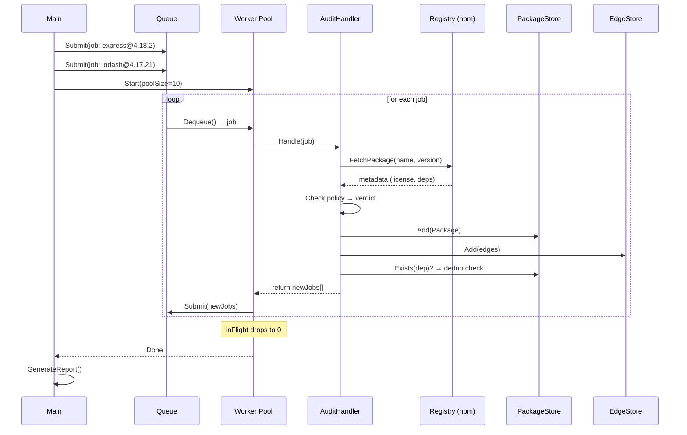

# Phase 1 — Bounded Worker Pool + Auditor Happy Path

Phase 1 delivers the first runnable slice of the system: a producer can submit jobs, a bounded pool of workers drains them, and the dependency auditor runs end-to-end on the happy path. No retries, no dead-letter queue, no persistence — those are later phases. Everything here is in-memory, and failures crash.

> **What's proven at the end of Phase 1:**
> Workers resolve, audit, and expand a dependency graph end-to-end — self-feeding, deduplication, backpressure, and a final report all work on the happy path.

---

## Scope

### In scope

| Concern | Detail |
|---|---|
| **Job struct** | `ID`, `Type`, `Payload`, `Status` — enough to describe and track a unit of work |
| **In-memory queue** | A Go buffered channel — no Postgres yet |
| **Bounded worker pool** | Fixed `N` goroutines pulling from the channel |
| **Job handler interface** | A `Handler` that workers call; the auditor implements it |
| **Auditor happy path** | Fetch metadata → audit → save node → save edges → enqueue children |
| **In-memory stores** | Thread-safe maps for `packages` and `edges` — stand-ins for Postgres |
| **Deduplication** | Check-before-enqueue against the in-memory packages map |
| **Completion detection** | Know when the graph is fully traversed and the audit is done |
| **Report generation** | Print policy violations, dependency paths, and summary stats |

### Out of scope (later phases)

| Concern | Phase |
|---|---|
| Retries / exponential backoff | Phase 2 |
| Dead-letter queue | Phase 3 |
| Postgres-backed storage | Phase 4 |
| Graceful shutdown with drain + timeout | Phase 5 |

---

## Project Layout

```
mini-distributed-job-api/
├── cmd/
│   └── auditor/
│       └── main.go              ← entry point: parse deps, seed queue, start pool, print report
├── internal/
│   ├── queue/
│   │   └── queue.go             ← Queue struct, Submit(), Dequeue(), channel management
│   ├── worker/
│   │   └── pool.go              ← Pool struct, Start(), worker loop, completion tracking
│   ├── job/
│   │   └── job.go               ← Job struct, Status enum, Handler interface
│   └── auditor/
│       ├── handler.go           ← AuditHandler: the 5-step job handler
│       ├── registry.go          ← HTTP client for the npm registry
│       ├── policy.go            ← License / version / vulnerability checks
│       ├── store.go             ← In-memory PackageStore + EdgeStore (thread-safe)
│       └── report.go            ← Report generation from completed graph
├── docs/
│   └── ...
├── go.mod
└── go.sum
```

---

## Component Specifications

### 1. Job (`internal/job/job.go`)

The generic unit of work. No queue-specific logic here — just data and the handler contract.

```go
type Status string

const (
    StatusPending   Status = "pending"
    StatusRunning   Status = "running"
    StatusCompleted Status = "completed"
)

type Job struct {
    ID      string
    Type    string
    Payload json.RawMessage
    Status  Status
}

// Handler processes a job and returns zero or more new jobs to enqueue.
type Handler interface {
    Handle(ctx context.Context, j Job) ([]Job, error)
}
```

**Key decision — `Handle` returns `[]Job`:** The handler can produce follow-up jobs (the self-feeding mechanic). The worker loop enqueues them after a successful handle. This keeps the handler unaware of the queue — it just says "here's more work."

---

### 2. Queue (`internal/queue/queue.go`)

An in-memory buffered channel. Phase 4 replaces the internals with Postgres — the interface stays the same.

```go
type Queue struct {
    ch chan job.Job
}

func New(bufferSize int) *Queue

// Submit pushes a job onto the channel. Non-blocking up to bufferSize.
func (q *Queue) Submit(j job.Job)

// Dequeue returns the next job. Blocks until one is available or the channel is closed.
func (q *Queue) Dequeue() (job.Job, bool)

// Close closes the underlying channel, signaling workers to stop.
func (q *Queue) Close()
```

**Buffer size:** The channel buffer absorbs bursts from self-feeding expansion. A reasonable default is `100` — large enough that a worker enqueuing 10 child jobs doesn't block, small enough that memory isn't wasted. The exact value is a tuning knob, not a correctness concern.

---

### 3. Worker Pool (`internal/worker/pool.go`)

A fixed number of goroutines, started once, each running the same loop.

```go
type Pool struct {
    size    int
    queue   *queue.Queue
    handler job.Handler
    wg      sync.WaitGroup
}

func New(size int, q *queue.Queue, h job.Handler) *Pool

// Start launches `size` worker goroutines.
func (p *Pool) Start(ctx context.Context)

// Wait blocks until all workers have exited.
func (p *Pool) Wait()
```

#### Worker loop (pseudocode)

```
workerLoop(id):
    loop:
        job, ok := queue.Dequeue()
        if !ok:
            return  // channel closed, exit

        job.Status = Running
        newJobs, err := handler.Handle(ctx, job)

        if err != nil:
            log error, continue  // Phase 1: log and move on, no retry
            continue

        job.Status = Completed

        for each newJob in newJobs:
            queue.Submit(newJob)
```

#### Completion detection

The pool needs to know when all work is done — not just when the channel is empty (it might refill), but when **no jobs are in-flight and no jobs are queued**.

Use an `atomic` in-flight counter:

```
Submit(job):
    inFlight.Add(1)
    ch <- job

workerLoop:
    for job := range ch:
        process(job)
        enqueue children      // each child calls inFlight.Add(1)
        inFlight.Add(-1)      // this job is done
        if inFlight.Load() == 0:
            signal done
```

When `inFlight` drops to zero, every job that was ever submitted has been completed, and no new children were produced. The traversal is done.

---

### 4. Auditor Handler (`internal/auditor/handler.go`)

Implements `job.Handler`. This is the 5-step resolve-and-audit logic from the architecture doc, adapted for Phase 1's in-memory stores.

```go
type AuditHandler struct {
    registry     RegistryClient
    policy       PolicyChecker
    packageStore *PackageStore
    edgeStore    *EdgeStore
}

func (h *AuditHandler) Handle(ctx context.Context, j job.Job) ([]job.Job, error)
```

#### The 5 steps

```
Handle(job):
    1. Parse payload → (name, version)

    2. Fetch metadata from registry
       → HTTP GET https://registry.npmjs.org/{name}/{version}
       → Extract: license, dependencies map

    3. Audit against policy
       → Check license against allowed list
       → Check version freshness (compare to latest)
       → Produce verdict: Pass | PolicyViolation

    4. Save the node
       → packageStore.Add(Package{name, version, license, verdict, ...})
       → If already exists (dedup), still continue to step 5
         (edges may not have been saved if previous insert was by another worker in a race)

    5. Save edges + enqueue new jobs
       → For each (depName, depVersion) in metadata.dependencies:
            edgeStore.Add(Edge{name, version, depName, depVersion})
            if !packageStore.Exists(depName, depVersion):
                create new Job{type: "audit_package", payload: {depName, depVersion}}
       → Return the new jobs list
```

---

### 5. Registry Client (`internal/auditor/registry.go`)

HTTP client for the npm registry. Phase 1 targets npm because its registry API is public, unauthenticated, and well-documented.

```go
type RegistryClient interface {
    FetchPackage(ctx context.Context, name, version string) (*PackageMetadata, error)
}

type PackageMetadata struct {
    Name         string
    Version      string
    License      string
    Dependencies map[string]string  // name → version range
}
```

#### Version resolution

The registry returns a version range for each dependency (e.g., `"^1.2.0"`). Phase 1 resolves this by:

1. Fetching the package's full metadata (`GET https://registry.npmjs.org/{name}`)
2. Selecting the highest version that satisfies the range from the `versions` map

This is a simplified semver resolution — good enough for a reference workload, not a production package manager.

---

### 6. Policy Checker (`internal/auditor/policy.go`)

Pure function — no I/O, no state.

```go
type PolicyChecker interface {
    Check(pkg PackageMetadata) Verdict
}

type Verdict string

const (
    VerdictPass            Verdict = "pass"
    VerdictPolicyViolation Verdict = "policy_violation"
)
```

#### Policy rules (Phase 1)

| Rule | Violation condition |
|---|---|
| **License allowlist** | License is not in `{MIT, Apache-2.0, ISC, BSD-2-Clause, BSD-3-Clause}` |
| **Version freshness** | *(Deferred — requires comparing against "latest", adds complexity)* |

Keep it simple — license checking alone is enough to produce real policy violations in any npm dependency tree.

---

### 7. In-Memory Stores (`internal/auditor/store.go`)

Thread-safe stand-ins for the Postgres tables defined in the data models doc. Replaced in Phase 4.

```go
// PackageStore is a thread-safe set of audited packages.
type PackageStore struct {
    mu       sync.RWMutex
    packages map[string]Package  // key: "name@version"
}

// Add inserts a package. Returns false if it already existed (dedup).
func (s *PackageStore) Add(p Package) bool

// Exists checks if a (name, version) pair has been seen.
func (s *PackageStore) Exists(name, version string) bool

// All returns all packages (for report generation).
func (s *PackageStore) All() []Package


// EdgeStore records dependency relationships.
type EdgeStore struct {
    mu    sync.RWMutex
    edges []DependencyEdge
}

// Add records an edge.
func (s *EdgeStore) Add(e DependencyEdge)

// All returns all edges (for report generation).
func (s *EdgeStore) All() []DependencyEdge
```

**Concurrency:** Multiple workers read/write these stores simultaneously. `sync.RWMutex` is correct — reads (dedup checks) are frequent and can overlap, writes (new packages) are less frequent and need exclusivity.

---

### 8. Report (`internal/auditor/report.go`)

Generated after the pool signals completion.

```go
type Report struct {
    TotalPackages    int
    PolicyViolations []PackageViolation
    DependencyPaths  map[string][]string  // violation → path from root
    Summary          string
}

func GenerateReport(packages *PackageStore, edges *EdgeStore, root string) *Report
```

#### Report contents

```
=== Dependency Audit Report ===

Root: my-app

Packages scanned: 47
Policy violations: 3
  ✗ evil-lib@0.1.0 — GPL-3.0 (license not in allowlist)
    Path: my-app → express@4.18.2 → body-parser@1.20.0 → evil-lib@0.1.0
  ✗ sketchy-pkg@2.3.1 — UNKNOWN (no license declared)
    Path: my-app → lodash@4.17.21 → sketchy-pkg@2.3.1
  ✗ old-thing@0.0.1 — WTFPL (license not in allowlist)
    Path: my-app → express@4.18.2 → old-thing@0.0.1

Clean: 44 packages passed all checks.
```

The path is computed by walking the `EdgeStore` backwards from the violation to the root.

---

## Entry Point (`cmd/auditor/main.go`)

```
main():
    1. Read a package.json path from CLI args
    2. Parse it → extract direct dependencies
    3. Resolve version ranges to exact versions
    4. Create Queue, PackageStore, EdgeStore, AuditHandler
    5. Seed the queue: one job per direct dependency
    6. Create Pool(size=10, queue, handler)
    7. pool.Start(ctx)
    8. pool.Wait()  // blocks until inFlight == 0
    9. GenerateReport(packageStore, edgeStore, rootName)
   10. Print report to stdout
```

---

## Data Flow (End-to-End)



---

## Concurrency Model

| Resource | Access pattern | Synchronization |
|---|---|---|
| **Channel** | Multiple writers (main + workers), multiple readers (workers) | Go channel — inherently safe |
| **PackageStore** | Many reads (dedup checks), fewer writes (new packages) | `sync.RWMutex` |
| **EdgeStore** | Append-only writes | `sync.Mutex` |
| **In-flight counter** | Increment on submit, decrement on complete | `sync/atomic` |
| **HTTP client** | Concurrent requests from N workers | `http.Client` is safe for concurrent use |

### Race condition: check-then-enqueue

Two workers resolve the same dependency simultaneously:

```
Worker A: Exists("bytes@3.1.2")? → false → enqueue
Worker B: Exists("bytes@3.1.2")? → false → enqueue
```

Both enqueue a job for `bytes@3.1.2`. This is **acceptable** in Phase 1 — the duplicate job runs, the `PackageStore.Add()` returns `false` (already exists), and the work is a no-op. This is the at-least-once property working as designed. The window is small and the consequence is one extra HTTP request, not data corruption.

In Phase 4, `ON CONFLICT DO NOTHING` in Postgres closes this gap at the storage level.

---

## Testing Strategy

### Unit tests

| Component | What's tested |
|---|---|
| `Queue` | Submit → Dequeue returns the same job. Close unblocks workers. Buffer backpressure. |
| `Pool` | Spawns exactly `size` workers. Processes all submitted jobs. Completion signal fires when done. |
| `AuditHandler` | Given mock registry responses, produces correct packages, edges, and child jobs. Dedup skips already-seen packages. |
| `PolicyChecker` | Each policy rule produces the correct verdict for known inputs. |
| `PackageStore` | Concurrent Add/Exists from multiple goroutines — no races (run with `-race`). |
| `Report` | Path computation: given a known graph, dependency paths are correct. |

### Integration test

A single end-to-end test using a **mock registry** (an `httptest.Server` returning canned responses for a small dependency tree):

```
Test graph:
    root → A → C
    root → B → C    (diamond)
    C → D

Expected:
    4 packages audited (A, B, C, D)
    C audited exactly once (dedup)
    5 edges recorded
    Report shows any policy violations from canned data
```

Run with `go test -race ./...` to catch concurrency bugs.

### Manual smoke test

Run the real auditor against a small, real npm package (e.g., `express`) and verify:
- The graph expands and then drains
- The report lists real licenses
- Known GPL-licensed transitive dependencies (if any) appear as violations

---

## Exit Criteria

Phase 1 is done when:

- [ ] `go run ./cmd/auditor/ package.json` runs against a real `package.json`, traverses the full dependency graph, and prints a report
- [ ] The pool is bounded — verified by limiting to `N=3` workers and confirming only 3 concurrent registry requests
- [ ] Deduplication works — diamond dependencies are audited once, not twice
- [ ] The integration test passes with `-race`
- [ ] The system terminates cleanly when the graph is fully explored
