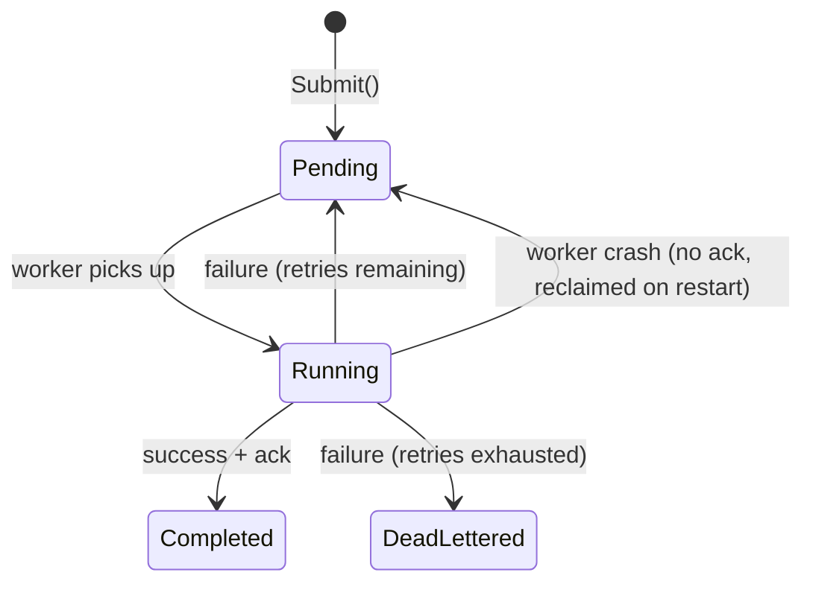

# Job Queue

The job queue is the core of the system. It holds work until a worker is ready, decoupling producers from workers so each runs at its own pace.

---

## Structure

The queue is two things working together:

| Layer | Technology | Role |
|---|---|---|
| **Signal layer** | Go buffered channel | Instant notification to workers that work is available |
| **Persistence layer** | Postgres `jobs` table | Durable record of every job and its state |

### Why both?

- **Channel alone** — fast, but everything in it vanishes on crash. Unacceptable for durable work.
- **Postgres alone** — crash-safe, but workers would have to poll the database in a loop to detect new jobs. Wasteful and adds latency.
- **Channel + Postgres** — Postgres is the source of truth. The channel is a lightweight signal that wakes workers instantly. Best of both.

---

## Job Lifecycle

A job moves through a fixed set of states:



Every state transition is written to Postgres before anything else happens. This is what makes the system crash-safe.

---

## Operations

### Submit

A producer submits a job. The call returns immediately — the producer never waits for the work to finish.

```
Submit(job):
    1. INSERT job into Postgres with status = Pending
    2. Push job onto the Go channel
    3. Return (producer is free)
```

### Dequeue

A worker pulls the next available job. If no jobs are available, the worker sleeps until one arrives.

```
Dequeue():
    1. Worker blocks on <-channel (sleeps until a job appears)
    2. UPDATE job in Postgres: status = Running
    3. Return the job to the worker
```

### Ack (success)

The worker finished the job successfully.

```
Ack(jobID):
    1. UPDATE job in Postgres: status = Completed
```

### Nack (failure)

The worker failed. The job goes back to the queue with a backoff delay, or to the dead-letter queue if retries are exhausted.

```
Nack(jobID, error):
    1. Increment job.Attempts
    2. If Attempts >= MaxRetries:
         UPDATE status = DeadLettered
    3. Else:
         UPDATE status = Pending
         SET ScheduledAt = now + backoff(Attempts)
         Push job back onto the channel (after delay)
```

### Crash Recovery

On startup, the queue reclaims any orphaned work.

```
Recover():
    1. SELECT * FROM jobs WHERE status = 'Running'
       → These workers crashed before acking
       → UPDATE status = Pending
    2. SELECT * FROM jobs WHERE status = 'Pending'
       → Push all onto the channel
    3. Workers start pulling as normal
```

No jobs are lost. This is the at-least-once delivery guarantee.

---

## Design Decisions

### 1. Channel as signal, Postgres as truth

**Decision:** The Go channel does not own the job data — it's only a notification mechanism. Postgres is the authoritative record.

**Tradeoff:** Slightly more complexity (two writes per submit) in exchange for crash safety. An in-memory-only queue would be simpler but would lose jobs on restart.

### 2. Buffered channel

**Decision:** The channel is buffered (finite capacity), not unbuffered.

**Tradeoff:** A buffer lets producers submit multiple jobs without blocking, absorbing short bursts. But the buffer size is a tuning knob — too small and producers block unnecessarily, too large and you consume memory for a signal layer that doesn't need to be large. The real capacity lives in Postgres, not the channel.

### 3. At-least-once delivery, not exactly-once

**Decision:** If a worker crashes after completing work but before acking, the job runs again on restart. The system guarantees every job runs **at least once**, not exactly once.

**Tradeoff:** Jobs must be idempotent or deduplicated — running a job twice must be safe. This is simpler and more reliable than attempting exactly-once delivery, which requires distributed transactions and is significantly harder to implement correctly.

### 4. Ack-after-complete, not ack-before-complete

**Decision:** A job is marked `Completed` only **after** the worker finishes. Not before.

**Tradeoff:** If the ack itself fails (Postgres is briefly unreachable after the work is done), the job will re-run on recovery. This is the correct direction to err — re-running safe work is better than marking a job done that never actually ran.

### 5. Status transitions in Postgres, not in memory

**Decision:** Every state change (Pending → Running → Completed) is persisted immediately, not batched or deferred.

**Tradeoff:** More database writes (one per transition), but the system can recover its exact state after any crash. Batching writes would be faster but would create a window where the in-memory state and the database disagree.
