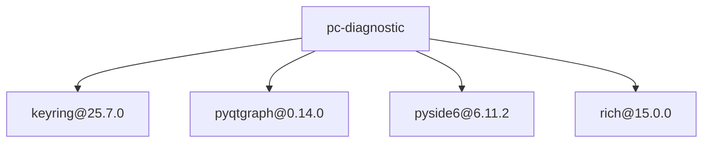
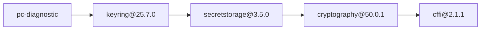
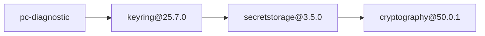
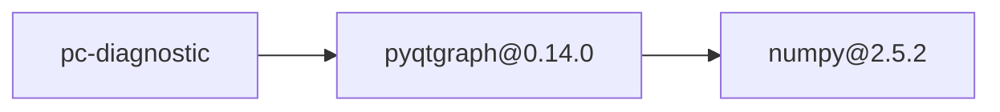
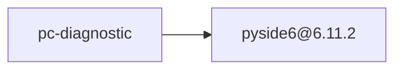
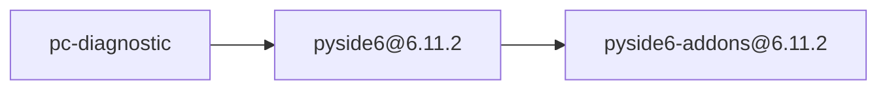
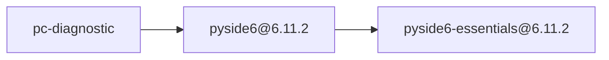
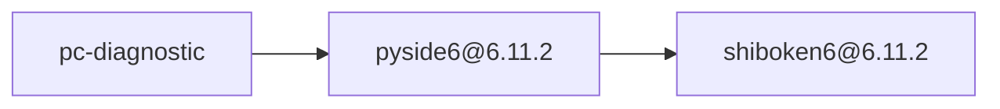
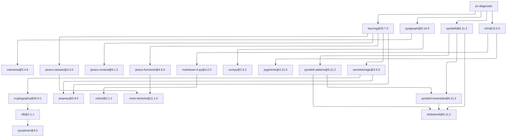

# Dependency Audit Report

## Summary

- Root: `pc-diagnostic`
- Python platform: `linux`
- Python version: `3.12`
- Packages scanned: 21
- Policy violations: 7

## Dependency Overview

## Violation Paths

### `cffi@2.1.1`

### `cryptography@50.0.1`

### `numpy@2.5.2`

### `pyside6@6.11.2`

### `pyside6-addons@6.11.2`

### `pyside6-essentials@6.11.2`

### `shiboken6@6.11.2`

## Complete Dependency Graph

Show all 21 packages and 26 edges

## Packages

| Package | Version | License | Verdict |
|---|---|---|---|
| `cffi` | `2.1.1` | `MIT-0` | `policy_violation` |
| `colorama` | `0.4.6` | `BSD-3-Clause` | `pass` |
| `cryptography` | `50.0.1` | `Apache-2.0 OR BSD-3-Clause` | `policy_violation` |
| `jaraco-classes` | `3.4.0` | `MIT` | `pass` |
| `jaraco-context` | `6.1.2` | `MIT` | `pass` |
| `jaraco-functools` | `4.6.0` | `MIT` | `pass` |
| `jeepney` | `0.9.0` | `MIT` | `pass` |
| `keyring` | `25.7.0` | `MIT` | `pass` |
| `markdown-it-py` | `4.2.0` | `MIT` | `pass` |
| `mdurl` | `0.1.2` | `MIT` | `pass` |
| `more-itertools` | `11.1.0` | `MIT` | `pass` |
| `numpy` | `2.5.2` | `BSD-3-Clause AND 0BSD AND MIT AND Zlib AND CC0-1.0` | `policy_violation` |
| `pycparser` | `3.0` | `BSD-3-Clause` | `pass` |
| `pygments` | `2.21.0` | `BSD-2-Clause` | `pass` |
| `pyqtgraph` | `0.14.0` | `MIT` | `pass` |
| `pyside6` | `6.11.2` | `LGPL-3.0-only OR GPL-2.0-only OR GPL-3.0-only` | `policy_violation` |
| `pyside6-addons` | `6.11.2` | `LGPL-3.0-only OR GPL-2.0-only OR GPL-3.0-only` | `policy_violation` |
| `pyside6-essentials` | `6.11.2` | `LGPL-3.0-only OR GPL-2.0-only OR GPL-3.0-only` | `policy_violation` |
| `rich` | `15.0.0` | `MIT` | `pass` |
| `secretstorage` | `3.5.0` | `BSD-3-Clause` | `pass` |
| `shiboken6` | `6.11.2` | `LGPL-3.0-only OR GPL-2.0-only OR GPL-3.0-only` | `policy_violation` |

## Policy Violations

| Package | License | Dependency path |
|---|---|---|
| `cffi@2.1.1` | `MIT-0` | `pc-diagnostic → keyring@25.7.0 → secretstorage@3.5.0 → cryptography@50.0.1 → cffi@2.1.1` |
| `cryptography@50.0.1` | `Apache-2.0 OR BSD-3-Clause` | `pc-diagnostic → keyring@25.7.0 → secretstorage@3.5.0 → cryptography@50.0.1` |
| `numpy@2.5.2` | `BSD-3-Clause AND 0BSD AND MIT AND Zlib AND CC0-1.0` | `pc-diagnostic → pyqtgraph@0.14.0 → numpy@2.5.2` |
| `pyside6@6.11.2` | `LGPL-3.0-only OR GPL-2.0-only OR GPL-3.0-only` | `pc-diagnostic → pyside6@6.11.2` |
| `pyside6-addons@6.11.2` | `LGPL-3.0-only OR GPL-2.0-only OR GPL-3.0-only` | `pc-diagnostic → pyside6@6.11.2 → pyside6-addons@6.11.2` |
| `pyside6-essentials@6.11.2` | `LGPL-3.0-only OR GPL-2.0-only OR GPL-3.0-only` | `pc-diagnostic → pyside6@6.11.2 → pyside6-essentials@6.11.2` |
| `shiboken6@6.11.2` | `LGPL-3.0-only OR GPL-2.0-only OR GPL-3.0-only` | `pc-diagnostic → pyside6@6.11.2 → shiboken6@6.11.2` |
