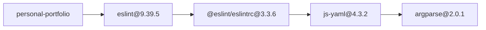
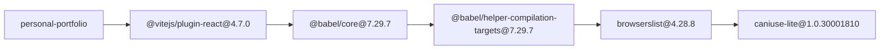
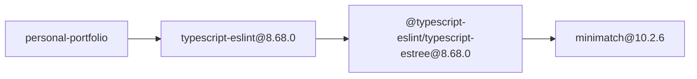

# Dependency Audit Report

## Summary

- Root: `personal-portfolio`
- Packages scanned: 185
- Policy violations: 4

## Dependency Overview

```mermaid
flowchart TB
    n0["@eslint/js@9.39.5"]
    n1["@tailwindcss/vite@4.3.3"]
    n2["@types/react@19.2.18"]
    n3["@types/react-dom@19.2.5"]
    n4["@vitejs/plugin-react@4.7.0"]
    n5["eslint@9.39.5"]
    n6["eslint-plugin-react-hooks@5.2.0"]
    n7["eslint-plugin-react-refresh@0.4.26"]
    n8["globals@16.5.0"]
    n9["personal-portfolio"]
    n10["react@19.2.8"]
    n11["react-dom@19.2.8"]
    n12["react-router-dom@7.18.3"]
    n13["tailwindcss@4.3.3"]
    n14["typescript@5.8.3"]
    n15["typescript-eslint@8.68.0"]
    n16["vite@6.4.3"]
    n9 --> n0
    n9 --> n1
    n9 --> n2
    n9 --> n3
    n9 --> n4
    n9 --> n5
    n9 --> n6
    n9 --> n7
    n9 --> n8
    n9 --> n10
    n9 --> n11
    n9 --> n12
    n9 --> n13
    n9 --> n14
    n9 --> n15
    n9 --> n16
```



## Violation Paths

### `argparse@2.0.1`



### `caniuse-lite@1.0.30001810`



### `lightningcss@1.32.0`


### `minimatch@10.2.6`



## Complete Dependency Graph

<details>
<summary>Show all 185 packages and 275 edges</summary>

```mermaid
---
config:
  layout: elk
  flowchart:
    useMaxWidth: false
    nodeSpacing: 35
    rankSpacing: 60
---
flowchart TB
    n0["@babel/code-frame@7.29.7"]
    n1["@babel/compat-data@7.29.7"]
    n2["@babel/core@7.29.7"]
    n3["@babel/generator@7.29.8"]
    n4["@babel/helper-compilation-targets@7.29.7"]
    n5["@babel/helper-globals@7.29.7"]
    n6["@babel/helper-module-imports@7.29.7"]
    n7["@babel/helper-module-transforms@7.29.7"]
    n8["@babel/helper-plugin-utils@7.29.7"]
    n9["@babel/helper-string-parser@7.29.7"]
    n10["@babel/helper-validator-identifier@7.29.7"]
    n11["@babel/helper-validator-option@7.29.7"]
    n12["@babel/helpers@7.29.7"]
    n13["@babel/parser@7.29.8"]
    n14["@babel/plugin-transform-react-jsx-self@7.29.7"]
    n15["@babel/plugin-transform-react-jsx-source@7.29.7"]
    n16["@babel/template@7.29.7"]
    n17["@babel/traverse@7.29.8"]
    n18["@babel/types@7.29.8"]
    n19["@eslint-community/eslint-utils@4.10.1"]
    n20["@eslint-community/regexpp@4.12.2"]
    n21["@eslint/config-array@0.21.2"]
    n22["@eslint/config-helpers@0.4.2"]
    n23["@eslint/core@0.17.0"]
    n24["@eslint/eslintrc@3.3.6"]
    n25["@eslint/js@9.39.5"]
    n26["@eslint/object-schema@2.1.7"]
    n27["@eslint/plugin-kit@0.4.1"]
    n28["@humanfs/core@0.19.2"]
    n29["@humanfs/node@0.16.8"]
    n30["@humanfs/types@0.15.0"]
    n31["@humanwhocodes/module-importer@1.0.1"]
    n32["@humanwhocodes/retry@0.4.3"]
    n33["@jridgewell/gen-mapping@0.3.13"]
    n34["@jridgewell/remapping@2.3.5"]
    n35["@jridgewell/resolve-uri@3.1.2"]
    n36["@jridgewell/sourcemap-codec@1.6.0"]
    n37["@jridgewell/trace-mapping@0.3.31"]
    n38["@rolldown/pluginutils@1.0.0-beta.27"]
    n39["@tailwindcss/node@4.3.3"]
    n40["@tailwindcss/oxide@4.3.3"]
    n41["@tailwindcss/vite@4.3.3"]
    n42["@types/babel__core@7.20.5"]
    n43["@types/babel__generator@7.27.0"]
    n44["@types/babel__template@7.4.4"]
    n45["@types/babel__traverse@7.28.0"]
    n46["@types/estree@1.0.9"]
    n47["@types/json-schema@7.0.15"]
    n48["@types/react@19.2.18"]
    n49["@types/react-dom@19.2.5"]
    n50["@typescript-eslint/eslint-plugin@8.68.0"]
    n51["@typescript-eslint/parser@8.68.0"]
    n52["@typescript-eslint/project-service@8.68.0"]
    n53["@typescript-eslint/scope-manager@8.68.0"]
    n54["@typescript-eslint/tsconfig-utils@8.68.0"]
    n55["@typescript-eslint/type-utils@8.68.0"]
    n56["@typescript-eslint/types@8.68.0"]
    n57["@typescript-eslint/typescript-estree@8.68.0"]
    n58["@typescript-eslint/utils@8.68.0"]
    n59["@typescript-eslint/visitor-keys@8.68.0"]
    n60["@vitejs/plugin-react@4.7.0"]
    n61["acorn@8.18.0"]
    n62["acorn-jsx@5.3.2"]
    n63["ajv@6.15.0"]
    n64["ansi-styles@4.3.0"]
    n65["argparse@2.0.1"]
    n66["balanced-match@1.0.2"]
    n67["balanced-match@4.0.4"]
    n68["baseline-browser-mapping@2.11.20"]
    n69["brace-expansion@1.1.18"]
    n70["brace-expansion@5.0.9"]
    n71["browserslist@4.28.8"]
    n72["callsites@3.1.0"]
    n73["caniuse-lite@1.0.30001810"]
    n74["chalk@4.1.2"]
    n75["color-convert@2.0.1"]
    n76["color-name@1.1.4"]
    n77["concat-map@0.0.1"]
    n78["convert-source-map@2.0.0"]
    n79["cookie@1.1.1"]
    n80["cross-spawn@7.0.6"]
    n81["csstype@3.2.3"]
    n82["debug@4.4.3"]
    n83["deep-is@0.1.4"]
    n84["detect-libc@2.1.2"]
    n85["electron-to-chromium@1.5.416"]
    n86["enhanced-resolve@5.24.5"]
    n87["esbuild@0.25.12"]
    n88["escalade@3.2.0"]
    n89["escape-string-regexp@4.0.0"]
    n90["eslint@9.39.5"]
    n91["eslint-plugin-react-hooks@5.2.0"]
    n92["eslint-plugin-react-refresh@0.4.26"]
    n93["eslint-scope@8.4.0"]
    n94["eslint-visitor-keys@3.4.3"]
    n95["eslint-visitor-keys@4.2.1"]
    n96["eslint-visitor-keys@5.0.1"]
    n97["espree@10.4.0"]
    n98["esquery@1.7.0"]
    n99["esrecurse@4.3.0"]
    n100["estraverse@5.3.0"]
    n101["esutils@2.0.3"]
    n102["fast-deep-equal@3.1.3"]
    n103["fast-json-stable-stringify@2.1.0"]
    n104["fast-levenshtein@2.0.6"]
    n105["fdir@6.5.0"]
    n106["file-entry-cache@8.0.0"]
    n107["find-up@5.0.0"]
    n108["flat-cache@4.0.1"]
    n109["flatted@3.4.4"]
    n110["gensync@1.0.0-beta.2"]
    n111["glob-parent@6.0.2"]
    n112["globals@14.0.0"]
    n113["globals@16.5.0"]
    n114["graceful-fs@4.2.11"]
    n115["has-flag@4.0.0"]
    n116["ignore@5.3.2"]
    n117["ignore@7.0.6"]
    n118["import-fresh@3.3.1"]
    n119["imurmurhash@0.1.4"]
    n120["is-extglob@2.1.1"]
    n121["is-glob@4.0.3"]
    n122["isexe@2.0.0"]
    n123["jiti@2.7.0"]
    n124["js-tokens@4.0.0"]
    n125["js-yaml@4.3.2"]
    n126["jsesc@3.1.0"]
    n127["json-buffer@3.0.1"]
    n128["json-schema-traverse@0.4.1"]
    n129["json-stable-stringify-without-jsonify@1.0.1"]
    n130["json5@2.2.3"]
    n131["keyv@4.5.4"]
    n132["levn@0.4.1"]
    n133["lightningcss@1.32.0"]
    n134["locate-path@6.0.0"]
    n135["lodash.merge@4.6.2"]
    n136["lru-cache@5.1.1"]
    n137["magic-string@0.30.21"]
    n138["minimatch@10.2.6"]
    n139["minimatch@3.1.5"]
    n140["ms@2.1.3"]
    n141["nanoid@3.3.18"]
    n142["natural-compare@1.4.0"]
    n143["node-releases@2.0.54"]
    n144["optionator@0.9.4"]
    n145["p-limit@3.1.0"]
    n146["p-locate@5.0.0"]
    n147["parent-module@1.0.1"]
    n148["path-exists@4.0.0"]
    n149["path-key@3.1.1"]
    n150["personal-portfolio"]
    n151["picocolors@1.1.1"]
    n152["picomatch@4.0.7"]
    n153["postcss@8.5.26"]
    n154["prelude-ls@1.2.1"]
    n155["punycode@2.3.1"]
    n156["react@19.2.8"]
    n157["react-dom@19.2.8"]
    n158["react-refresh@0.17.0"]
    n159["react-router@7.18.3"]
    n160["react-router-dom@7.18.3"]
    n161["resolve-from@4.0.0"]
    n162["rollup@4.63.1"]
    n163["scheduler@0.27.0"]
    n164["semver@6.3.1"]
    n165["semver@7.8.5"]
    n166["set-cookie-parser@2.7.2"]
    n167["shebang-command@2.0.0"]
    n168["shebang-regex@3.0.0"]
    n169["source-map-js@1.2.1"]
    n170["strip-json-comments@3.1.1"]
    n171["supports-color@7.2.0"]
    n172["tailwindcss@4.3.3"]
    n173["tapable@2.3.3"]
    n174["tinyglobby@0.2.17"]
    n175["ts-api-utils@2.5.0"]
    n176["type-check@0.4.0"]
    n177["typescript@5.8.3"]
    n178["typescript-eslint@8.68.0"]
    n179["update-browserslist-db@1.3.2"]
    n180["uri-js@4.4.1"]
    n181["vite@6.4.3"]
    n182["which@2.0.2"]
    n183["word-wrap@1.2.5"]
    n184["yallist@3.1.1"]
    n185["yocto-queue@0.1.0"]
    n0 --> n10
    n0 --> n124
    n0 --> n151
    n2 --> n0
    n2 --> n3
    n2 --> n4
    n2 --> n7
    n2 --> n12
    n2 --> n13
    n2 --> n16
    n2 --> n17
    n2 --> n18
    n2 --> n34
    n2 --> n78
    n2 --> n82
    n2 --> n110
    n2 --> n130
    n2 --> n164
    n3 --> n13
    n3 --> n18
    n3 --> n33
    n3 --> n37
    n3 --> n126
    n4 --> n1
    n4 --> n11
    n4 --> n71
    n4 --> n136
    n4 --> n164
    n6 --> n17
    n6 --> n18
    n7 --> n6
    n7 --> n10
    n7 --> n17
    n12 --> n16
    n12 --> n18
    n13 --> n18
    n14 --> n8
    n15 --> n8
    n16 --> n0
    n16 --> n13
    n16 --> n18
    n17 --> n0
    n17 --> n3
    n17 --> n5
    n17 --> n13
    n17 --> n16
    n17 --> n18
    n17 --> n82
    n18 --> n9
    n18 --> n10
    n19 --> n94
    n21 --> n26
    n21 --> n82
    n21 --> n139
    n22 --> n23
    n23 --> n47
    n24 --> n63
    n24 --> n82
    n24 --> n97
    n24 --> n112
    n24 --> n116
    n24 --> n118
    n24 --> n125
    n24 --> n139
    n24 --> n170
    n27 --> n23
    n27 --> n132
    n28 --> n30
    n29 --> n28
    n29 --> n30
    n29 --> n32
    n33 --> n36
    n33 --> n37
    n34 --> n33
    n34 --> n37
    n37 --> n35
    n37 --> n36
    n39 --> n34
    n39 --> n86
    n39 --> n123
    n39 --> n133
    n39 --> n137
    n39 --> n169
    n39 --> n172
    n41 --> n39
    n41 --> n40
    n41 --> n172
    n42 --> n13
    n42 --> n18
    n42 --> n43
    n42 --> n44
    n42 --> n45
    n43 --> n18
    n44 --> n13
    n44 --> n18
    n45 --> n18
    n48 --> n81
    n50 --> n20
    n50 --> n53
    n50 --> n55
    n50 --> n58
    n50 --> n59
    n50 --> n117
    n50 --> n142
    n50 --> n175
    n51 --> n53
    n51 --> n56
    n51 --> n57
    n51 --> n59
    n51 --> n82
    n52 --> n54
    n52 --> n56
    n52 --> n82
    n53 --> n56
    n53 --> n59
    n55 --> n56
    n55 --> n57
    n55 --> n58
    n55 --> n82
    n55 --> n175
    n57 --> n52
    n57 --> n54
    n57 --> n56
    n57 --> n59
    n57 --> n82
    n57 --> n138
    n57 --> n165
    n57 --> n174
    n57 --> n175
    n58 --> n19
    n58 --> n53
    n58 --> n56
    n58 --> n57
    n59 --> n56
    n59 --> n96
    n60 --> n2
    n60 --> n14
    n60 --> n15
    n60 --> n38
    n60 --> n42
    n60 --> n158
    n63 --> n102
    n63 --> n103
    n63 --> n128
    n63 --> n180
    n64 --> n75
    n69 --> n66
    n69 --> n77
    n70 --> n67
    n71 --> n68
    n71 --> n73
    n71 --> n85
    n71 --> n143
    n71 --> n179
    n74 --> n64
    n74 --> n171
    n75 --> n76
    n80 --> n149
    n80 --> n167
    n80 --> n182
    n82 --> n140
    n86 --> n114
    n86 --> n173
    n90 --> n19
    n90 --> n20
    n90 --> n21
    n90 --> n22
    n90 --> n23
    n90 --> n24
    n90 --> n25
    n90 --> n27
    n90 --> n29
    n90 --> n31
    n90 --> n32
    n90 --> n46
    n90 --> n63
    n90 --> n74
    n90 --> n80
    n90 --> n82
    n90 --> n89
    n90 --> n93
    n90 --> n95
    n90 --> n97
    n90 --> n98
    n90 --> n101
    n90 --> n102
    n90 --> n106
    n90 --> n107
    n90 --> n111
    n90 --> n116
    n90 --> n119
    n90 --> n121
    n90 --> n129
    n90 --> n135
    n90 --> n139
    n90 --> n142
    n90 --> n144
    n93 --> n99
    n93 --> n100
    n97 --> n61
    n97 --> n62
    n97 --> n95
    n98 --> n100
    n99 --> n100
    n106 --> n108
    n107 --> n134
    n107 --> n148
    n108 --> n109
    n108 --> n131
    n111 --> n121
    n118 --> n147
    n118 --> n161
    n121 --> n120
    n125 --> n65
    n131 --> n127
    n132 --> n154
    n132 --> n176
    n133 --> n84
    n134 --> n146
    n136 --> n184
    n137 --> n36
    n138 --> n70
    n139 --> n69
    n144 --> n83
    n144 --> n104
    n144 --> n132
    n144 --> n154
    n144 --> n176
    n144 --> n183
    n145 --> n185
    n146 --> n145
    n147 --> n72
    n150 --> n25
    n150 --> n41
    n150 --> n48
    n150 --> n49
    n150 --> n60
    n150 --> n90
    n150 --> n91
    n150 --> n92
    n150 --> n113
    n150 --> n156
    n150 --> n157
    n150 --> n160
    n150 --> n172
    n150 --> n177
    n150 --> n178
    n150 --> n181
    n153 --> n141
    n153 --> n151
    n153 --> n169
    n157 --> n163
    n159 --> n79
    n159 --> n166
    n160 --> n159
    n162 --> n46
    n167 --> n168
    n171 --> n115
    n174 --> n105
    n174 --> n152
    n176 --> n154
    n178 --> n50
    n178 --> n51
    n178 --> n57
    n178 --> n58
    n179 --> n88
    n179 --> n151
    n180 --> n155
    n181 --> n87
    n181 --> n105
    n181 --> n152
    n181 --> n153
    n181 --> n162
    n181 --> n174
    n182 --> n122
```

</details>

## Packages

| Package | Version | License | Verdict |
|---|---|---|---|
| `@babel/code-frame` | `7.29.7` | `MIT` | `pass` |
| `@babel/compat-data` | `7.29.7` | `MIT` | `pass` |
| `@babel/core` | `7.29.7` | `MIT` | `pass` |
| `@babel/generator` | `7.29.8` | `MIT` | `pass` |
| `@babel/helper-compilation-targets` | `7.29.7` | `MIT` | `pass` |
| `@babel/helper-globals` | `7.29.7` | `MIT` | `pass` |
| `@babel/helper-module-imports` | `7.29.7` | `MIT` | `pass` |
| `@babel/helper-module-transforms` | `7.29.7` | `MIT` | `pass` |
| `@babel/helper-plugin-utils` | `7.29.7` | `MIT` | `pass` |
| `@babel/helper-string-parser` | `7.29.7` | `MIT` | `pass` |
| `@babel/helper-validator-identifier` | `7.29.7` | `MIT` | `pass` |
| `@babel/helper-validator-option` | `7.29.7` | `MIT` | `pass` |
| `@babel/helpers` | `7.29.7` | `MIT` | `pass` |
| `@babel/parser` | `7.29.8` | `MIT` | `pass` |
| `@babel/plugin-transform-react-jsx-self` | `7.29.7` | `MIT` | `pass` |
| `@babel/plugin-transform-react-jsx-source` | `7.29.7` | `MIT` | `pass` |
| `@babel/template` | `7.29.7` | `MIT` | `pass` |
| `@babel/traverse` | `7.29.8` | `MIT` | `pass` |
| `@babel/types` | `7.29.8` | `MIT` | `pass` |
| `@eslint-community/eslint-utils` | `4.10.1` | `MIT` | `pass` |
| `@eslint-community/regexpp` | `4.12.2` | `MIT` | `pass` |
| `@eslint/config-array` | `0.21.2` | `Apache-2.0` | `pass` |
| `@eslint/config-helpers` | `0.4.2` | `Apache-2.0` | `pass` |
| `@eslint/core` | `0.17.0` | `Apache-2.0` | `pass` |
| `@eslint/eslintrc` | `3.3.6` | `MIT` | `pass` |
| `@eslint/js` | `9.39.5` | `MIT` | `pass` |
| `@eslint/object-schema` | `2.1.7` | `Apache-2.0` | `pass` |
| `@eslint/plugin-kit` | `0.4.1` | `Apache-2.0` | `pass` |
| `@humanfs/core` | `0.19.2` | `Apache-2.0` | `pass` |
| `@humanfs/node` | `0.16.8` | `Apache-2.0` | `pass` |
| `@humanfs/types` | `0.15.0` | `Apache-2.0` | `pass` |
| `@humanwhocodes/module-importer` | `1.0.1` | `Apache-2.0` | `pass` |
| `@humanwhocodes/retry` | `0.4.3` | `Apache-2.0` | `pass` |
| `@jridgewell/gen-mapping` | `0.3.13` | `MIT` | `pass` |
| `@jridgewell/remapping` | `2.3.5` | `MIT` | `pass` |
| `@jridgewell/resolve-uri` | `3.1.2` | `MIT` | `pass` |
| `@jridgewell/sourcemap-codec` | `1.6.0` | `MIT` | `pass` |
| `@jridgewell/trace-mapping` | `0.3.31` | `MIT` | `pass` |
| `@rolldown/pluginutils` | `1.0.0-beta.27` | `MIT` | `pass` |
| `@tailwindcss/node` | `4.3.3` | `MIT` | `pass` |
| `@tailwindcss/oxide` | `4.3.3` | `MIT` | `pass` |
| `@tailwindcss/vite` | `4.3.3` | `MIT` | `pass` |
| `@types/babel__core` | `7.20.5` | `MIT` | `pass` |
| `@types/babel__generator` | `7.27.0` | `MIT` | `pass` |
| `@types/babel__template` | `7.4.4` | `MIT` | `pass` |
| `@types/babel__traverse` | `7.28.0` | `MIT` | `pass` |
| `@types/estree` | `1.0.9` | `MIT` | `pass` |
| `@types/json-schema` | `7.0.15` | `MIT` | `pass` |
| `@types/react` | `19.2.18` | `MIT` | `pass` |
| `@types/react-dom` | `19.2.5` | `MIT` | `pass` |
| `@typescript-eslint/eslint-plugin` | `8.68.0` | `MIT` | `pass` |
| `@typescript-eslint/parser` | `8.68.0` | `MIT` | `pass` |
| `@typescript-eslint/project-service` | `8.68.0` | `MIT` | `pass` |
| `@typescript-eslint/scope-manager` | `8.68.0` | `MIT` | `pass` |
| `@typescript-eslint/tsconfig-utils` | `8.68.0` | `MIT` | `pass` |
| `@typescript-eslint/type-utils` | `8.68.0` | `MIT` | `pass` |
| `@typescript-eslint/types` | `8.68.0` | `MIT` | `pass` |
| `@typescript-eslint/typescript-estree` | `8.68.0` | `MIT` | `pass` |
| `@typescript-eslint/utils` | `8.68.0` | `MIT` | `pass` |
| `@typescript-eslint/visitor-keys` | `8.68.0` | `MIT` | `pass` |
| `@vitejs/plugin-react` | `4.7.0` | `MIT` | `pass` |
| `acorn` | `8.18.0` | `MIT` | `pass` |
| `acorn-jsx` | `5.3.2` | `MIT` | `pass` |
| `ajv` | `6.15.0` | `MIT` | `pass` |
| `ansi-styles` | `4.3.0` | `MIT` | `pass` |
| `argparse` | `2.0.1` | `Python-2.0` | `policy_violation` |
| `balanced-match` | `1.0.2` | `MIT` | `pass` |
| `balanced-match` | `4.0.4` | `MIT` | `pass` |
| `baseline-browser-mapping` | `2.11.20` | `Apache-2.0` | `pass` |
| `brace-expansion` | `1.1.18` | `MIT` | `pass` |
| `brace-expansion` | `5.0.9` | `MIT` | `pass` |
| `browserslist` | `4.28.8` | `MIT` | `pass` |
| `callsites` | `3.1.0` | `MIT` | `pass` |
| `caniuse-lite` | `1.0.30001810` | `CC-BY-4.0` | `policy_violation` |
| `chalk` | `4.1.2` | `MIT` | `pass` |
| `color-convert` | `2.0.1` | `MIT` | `pass` |
| `color-name` | `1.1.4` | `MIT` | `pass` |
| `concat-map` | `0.0.1` | `MIT` | `pass` |
| `convert-source-map` | `2.0.0` | `MIT` | `pass` |
| `cookie` | `1.1.1` | `MIT` | `pass` |
| `cross-spawn` | `7.0.6` | `MIT` | `pass` |
| `csstype` | `3.2.3` | `MIT` | `pass` |
| `debug` | `4.4.3` | `MIT` | `pass` |
| `deep-is` | `0.1.4` | `MIT` | `pass` |
| `detect-libc` | `2.1.2` | `Apache-2.0` | `pass` |
| `electron-to-chromium` | `1.5.416` | `ISC` | `pass` |
| `enhanced-resolve` | `5.24.5` | `MIT` | `pass` |
| `esbuild` | `0.25.12` | `MIT` | `pass` |
| `escalade` | `3.2.0` | `MIT` | `pass` |
| `escape-string-regexp` | `4.0.0` | `MIT` | `pass` |
| `eslint` | `9.39.5` | `MIT` | `pass` |
| `eslint-plugin-react-hooks` | `5.2.0` | `MIT` | `pass` |
| `eslint-plugin-react-refresh` | `0.4.26` | `MIT` | `pass` |
| `eslint-scope` | `8.4.0` | `BSD-2-Clause` | `pass` |
| `eslint-visitor-keys` | `3.4.3` | `Apache-2.0` | `pass` |
| `eslint-visitor-keys` | `4.2.1` | `Apache-2.0` | `pass` |
| `eslint-visitor-keys` | `5.0.1` | `Apache-2.0` | `pass` |
| `espree` | `10.4.0` | `BSD-2-Clause` | `pass` |
| `esquery` | `1.7.0` | `BSD-3-Clause` | `pass` |
| `esrecurse` | `4.3.0` | `BSD-2-Clause` | `pass` |
| `estraverse` | `5.3.0` | `BSD-2-Clause` | `pass` |
| `esutils` | `2.0.3` | `BSD-2-Clause` | `pass` |
| `fast-deep-equal` | `3.1.3` | `MIT` | `pass` |
| `fast-json-stable-stringify` | `2.1.0` | `MIT` | `pass` |
| `fast-levenshtein` | `2.0.6` | `MIT` | `pass` |
| `fdir` | `6.5.0` | `MIT` | `pass` |
| `file-entry-cache` | `8.0.0` | `MIT` | `pass` |
| `find-up` | `5.0.0` | `MIT` | `pass` |
| `flat-cache` | `4.0.1` | `MIT` | `pass` |
| `flatted` | `3.4.4` | `ISC` | `pass` |
| `gensync` | `1.0.0-beta.2` | `MIT` | `pass` |
| `glob-parent` | `6.0.2` | `ISC` | `pass` |
| `globals` | `14.0.0` | `MIT` | `pass` |
| `globals` | `16.5.0` | `MIT` | `pass` |
| `graceful-fs` | `4.2.11` | `ISC` | `pass` |
| `has-flag` | `4.0.0` | `MIT` | `pass` |
| `ignore` | `5.3.2` | `MIT` | `pass` |
| `ignore` | `7.0.6` | `MIT` | `pass` |
| `import-fresh` | `3.3.1` | `MIT` | `pass` |
| `imurmurhash` | `0.1.4` | `MIT` | `pass` |
| `is-extglob` | `2.1.1` | `MIT` | `pass` |
| `is-glob` | `4.0.3` | `MIT` | `pass` |
| `isexe` | `2.0.0` | `ISC` | `pass` |
| `jiti` | `2.7.0` | `MIT` | `pass` |
| `js-tokens` | `4.0.0` | `MIT` | `pass` |
| `js-yaml` | `4.3.2` | `MIT` | `pass` |
| `jsesc` | `3.1.0` | `MIT` | `pass` |
| `json-buffer` | `3.0.1` | `MIT` | `pass` |
| `json-schema-traverse` | `0.4.1` | `MIT` | `pass` |
| `json-stable-stringify-without-jsonify` | `1.0.1` | `MIT` | `pass` |
| `json5` | `2.2.3` | `MIT` | `pass` |
| `keyv` | `4.5.4` | `MIT` | `pass` |
| `levn` | `0.4.1` | `MIT` | `pass` |
| `lightningcss` | `1.32.0` | `MPL-2.0` | `policy_violation` |
| `locate-path` | `6.0.0` | `MIT` | `pass` |
| `lodash.merge` | `4.6.2` | `MIT` | `pass` |
| `lru-cache` | `5.1.1` | `ISC` | `pass` |
| `magic-string` | `0.30.21` | `MIT` | `pass` |
| `minimatch` | `10.2.6` | `BlueOak-1.0.0` | `policy_violation` |
| `minimatch` | `3.1.5` | `ISC` | `pass` |
| `ms` | `2.1.3` | `MIT` | `pass` |
| `nanoid` | `3.3.18` | `MIT` | `pass` |
| `natural-compare` | `1.4.0` | `MIT` | `pass` |
| `node-releases` | `2.0.54` | `MIT` | `pass` |
| `optionator` | `0.9.4` | `MIT` | `pass` |
| `p-limit` | `3.1.0` | `MIT` | `pass` |
| `p-locate` | `5.0.0` | `MIT` | `pass` |
| `parent-module` | `1.0.1` | `MIT` | `pass` |
| `path-exists` | `4.0.0` | `MIT` | `pass` |
| `path-key` | `3.1.1` | `MIT` | `pass` |
| `picocolors` | `1.1.1` | `ISC` | `pass` |
| `picomatch` | `4.0.7` | `MIT` | `pass` |
| `postcss` | `8.5.26` | `MIT` | `pass` |
| `prelude-ls` | `1.2.1` | `MIT` | `pass` |
| `punycode` | `2.3.1` | `MIT` | `pass` |
| `react` | `19.2.8` | `MIT` | `pass` |
| `react-dom` | `19.2.8` | `MIT` | `pass` |
| `react-refresh` | `0.17.0` | `MIT` | `pass` |
| `react-router` | `7.18.3` | `MIT` | `pass` |
| `react-router-dom` | `7.18.3` | `MIT` | `pass` |
| `resolve-from` | `4.0.0` | `MIT` | `pass` |
| `rollup` | `4.63.1` | `MIT` | `pass` |
| `scheduler` | `0.27.0` | `MIT` | `pass` |
| `semver` | `6.3.1` | `ISC` | `pass` |
| `semver` | `7.8.5` | `ISC` | `pass` |
| `set-cookie-parser` | `2.7.2` | `MIT` | `pass` |
| `shebang-command` | `2.0.0` | `MIT` | `pass` |
| `shebang-regex` | `3.0.0` | `MIT` | `pass` |
| `source-map-js` | `1.2.1` | `BSD-3-Clause` | `pass` |
| `strip-json-comments` | `3.1.1` | `MIT` | `pass` |
| `supports-color` | `7.2.0` | `MIT` | `pass` |
| `tailwindcss` | `4.3.3` | `MIT` | `pass` |
| `tapable` | `2.3.3` | `MIT` | `pass` |
| `tinyglobby` | `0.2.17` | `MIT` | `pass` |
| `ts-api-utils` | `2.5.0` | `MIT` | `pass` |
| `type-check` | `0.4.0` | `MIT` | `pass` |
| `typescript` | `5.8.3` | `Apache-2.0` | `pass` |
| `typescript-eslint` | `8.68.0` | `MIT` | `pass` |
| `update-browserslist-db` | `1.3.2` | `MIT` | `pass` |
| `uri-js` | `4.4.1` | `BSD-2-Clause` | `pass` |
| `vite` | `6.4.3` | `MIT` | `pass` |
| `which` | `2.0.2` | `ISC` | `pass` |
| `word-wrap` | `1.2.5` | `MIT` | `pass` |
| `yallist` | `3.1.1` | `ISC` | `pass` |
| `yocto-queue` | `0.1.0` | `MIT` | `pass` |

## Policy Violations

| Package | License | Dependency path |
|---|---|---|
| `argparse@2.0.1` | `Python-2.0` | `personal-portfolio → eslint@9.39.5 → @eslint/eslintrc@3.3.6 → js-yaml@4.3.2 → argparse@2.0.1` |
| `caniuse-lite@1.0.30001810` | `CC-BY-4.0` | `personal-portfolio → @vitejs/plugin-react@4.7.0 → @babel/core@7.29.7 → @babel/helper-compilation-targets@7.29.7 → browserslist@4.28.8 → caniuse-lite@1.0.30001810` |
| `lightningcss@1.32.0` | `MPL-2.0` | `personal-portfolio → @tailwindcss/vite@4.3.3 → @tailwindcss/node@4.3.3 → lightningcss@1.32.0` |
| `minimatch@10.2.6` | `BlueOak-1.0.0` | `personal-portfolio → typescript-eslint@8.68.0 → @typescript-eslint/typescript-estree@8.68.0 → minimatch@10.2.6` |
