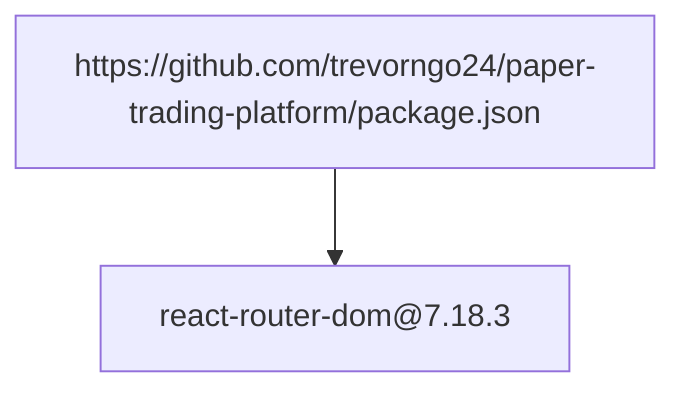
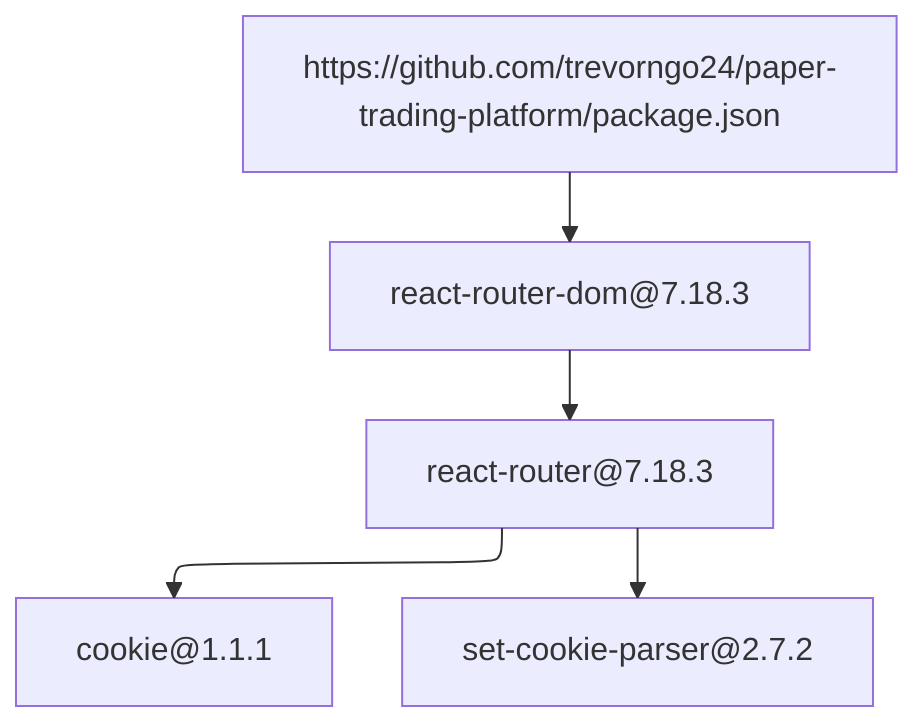

# Dependency Audit Report

## Summary

- Root: `https://github.com/trevorngo24/paper-trading-platform/package.json`
- Packages scanned: 4
- Policy violations: 0

## Dependency Overview

## Violation Paths

No policy violation paths.

## Complete Dependency Graph

Show all 4 packages and 4 edges

## Packages

| Package | Version | License | Verdict |
|---|---|---|---|
| `cookie` | `1.1.1` | `MIT` | `pass` |
| `react-router` | `7.18.3` | `MIT` | `pass` |
| `react-router-dom` | `7.18.3` | `MIT` | `pass` |
| `set-cookie-parser` | `2.7.2` | `MIT` | `pass` |

## Policy Violations

| Package | License | Dependency path |
|---|---|---|
